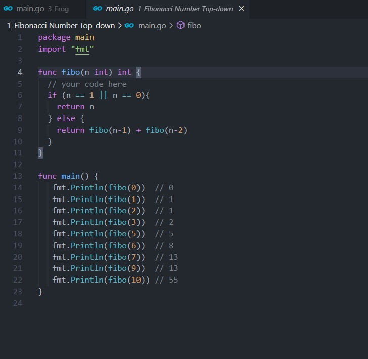
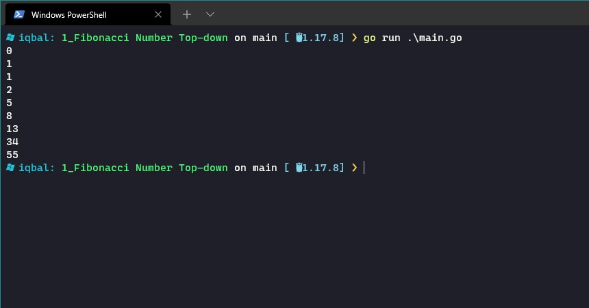
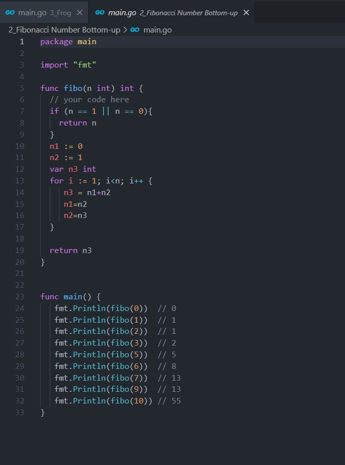
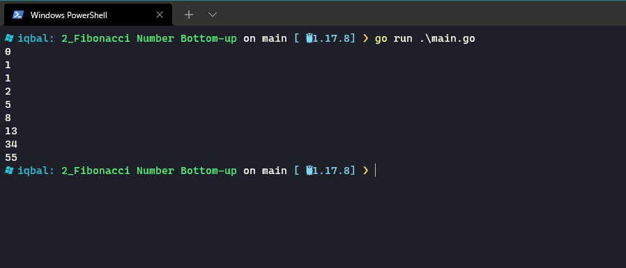
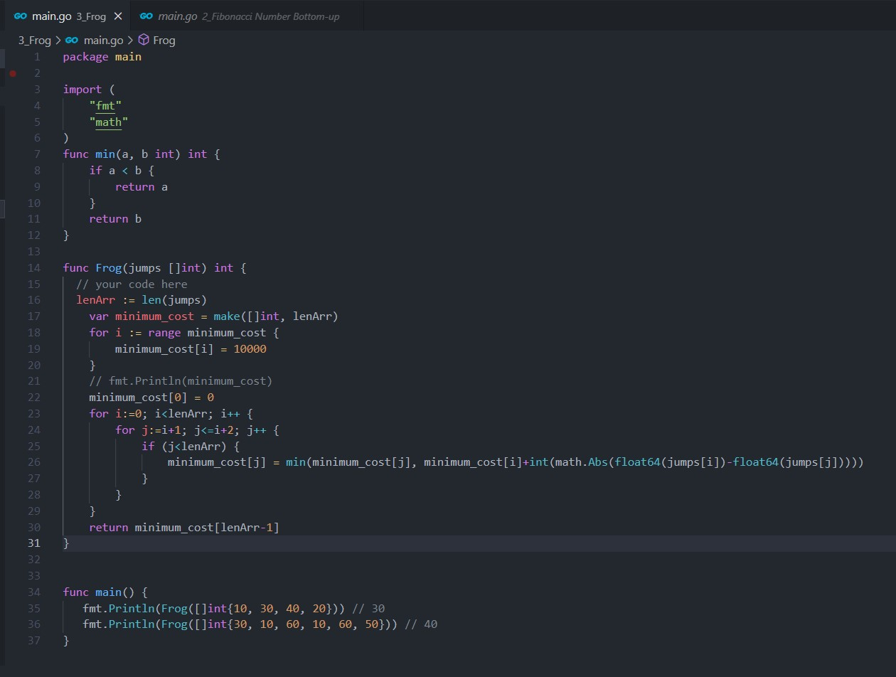
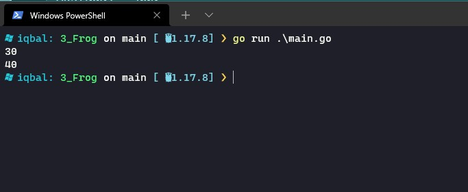

# (10) Dynamic Programming

- [Resume](#resume)
- [Praktikum](#praktikum)

# Resume

## A. Brute Force

# Praktikum
## 1. Fibonacci Number Top Down

source code:  

output:  
source code:  

## 2. Fibonacci Number Down Top  

source code:  

output:  
source code:  

## 3. Frog

source code:  

output:  
source code:  

