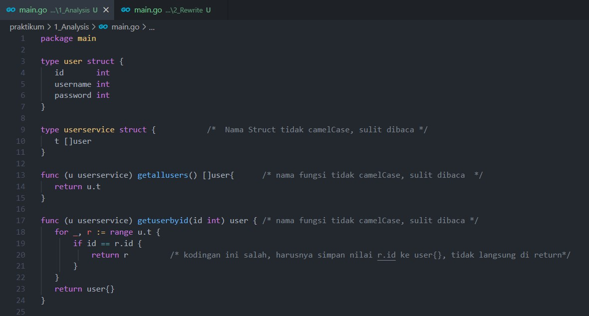
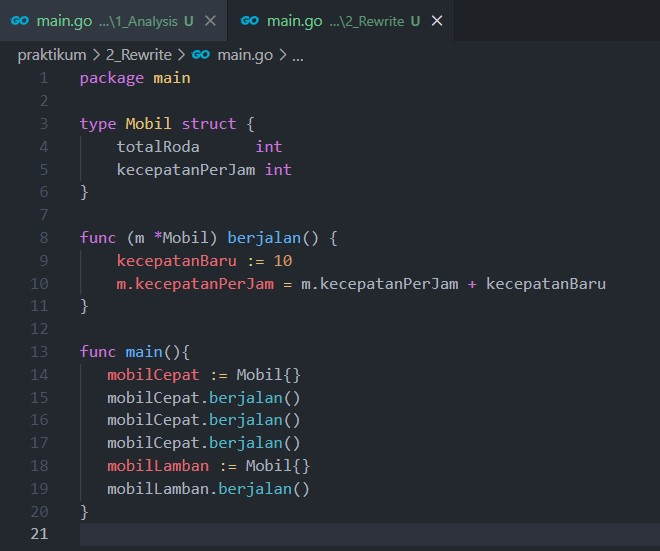

# (12) Clean Code

- [Resume](#resume)
- [Praktikum](#praktikum)

# Resume
## Pengertian
Clean Code adalah istilah untuk kode yang mudah dibaca, dipahami, dan diubah oleh programmer

## Kenapa clean code
- Work Collaboration
- Feature Development
- Faster Development

## Karakteristik clean code
1. Penamaan mudah dipahami
2. Mudah dieja dan dicari
3. Singkat namum mendeskripsikan konteks
4. Konsisten
5. Hindari penambahan konteks yang tidak perlu
6. Komentar tersusun rapi
7. Function yang jelas menggambarkan apa yang dilakukan
8. Gunakan konvensi seperti style guide
9. Gunakan Formatting yang sesuai

## Clean Code Principle
1. KISS (Keep it So Simple)
2. Dry (Don't Repeat Yourself)

# Praktikum
## 1. Analysis
Pada task ini, saya diharuskan untuk menganalisis source code yang tidak mengikuti kaidah dari clean code  

Berikut merupakan source code hasil analysis saya:   

## 2. Analysis

Berikut merupakan source code hasil rewrite saya:  

