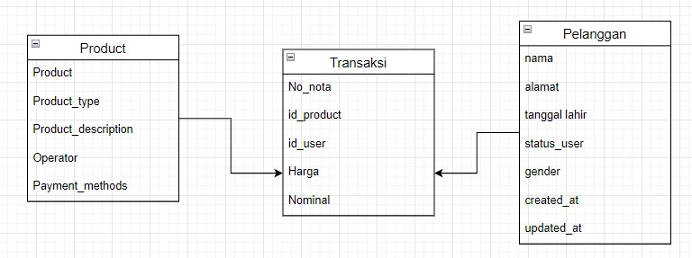

# (13) Database - DDL - DML

- [Resume](#resume)
- [Praktikum](#praktikum)

## Resume
Database adalah sekumpulan data yang teroganisir

Pada database ada yang disebut relationship, yaitu hubungan antara entitas didalam database. Beberapa hubungan tersebut adalah:
1. One-to-one
2. One-to-many
3. Many-to-many

Untuk pengimplementasian sebuah database, kita membutuhkan tools yang disebut `RDBMS`, dan untuk menggunakan **RDBMS** tersebut kita harus menggunakan perintah yang disebut SQL (Structure Query Language). 

Ada beberapa jenis perintah SQL, yaitu :
1. DDL (Data Definition Language)
2. DML (Data Definition Language)
3. DCL (Data control language)

Contoh beberapa perintah SQL
DDL :
- Create Database
- Use database
- Create table
- Drop table
- Rename Table

DML :
- Insert
- Select
- Update
- Delete

## Praktikum
### 1. Database Relational : Implement schema (Digital Outlet Pulsa)
Pada task ini, saya diharuskan untuk membuat sebuah ERD (Entity Relational Diagram) dari kasus outlet pulsa

Berikut merupakan ERD outlet pulsa:   

### 2. Data Definition Language
Pada task ini, saya diharuskan untuk membuat sebuah DDL dari diagram ERD sebelumnya

Berikut merupakan source code `sql` penerapan DDL  
[Source code](./praktikum/outlet_pulsa.sql)
