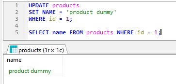
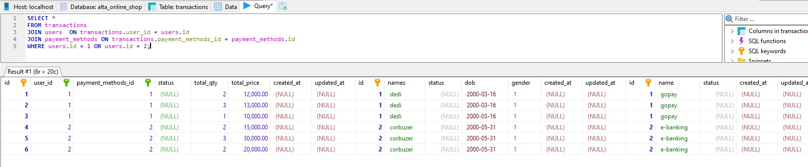
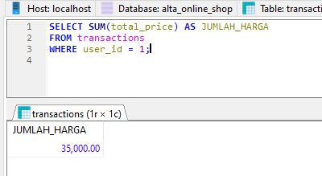
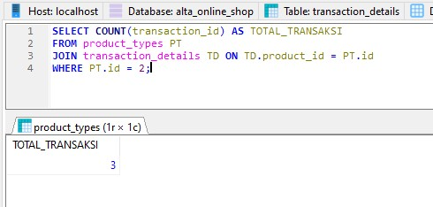
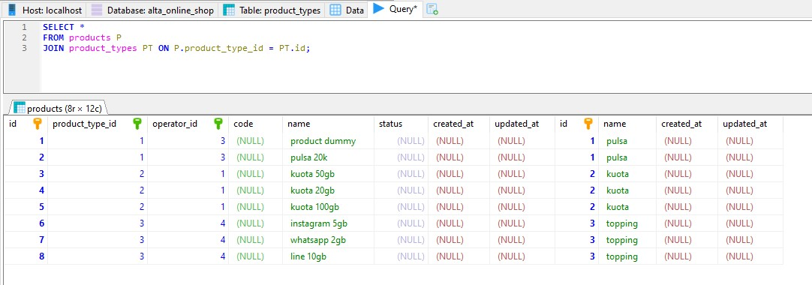
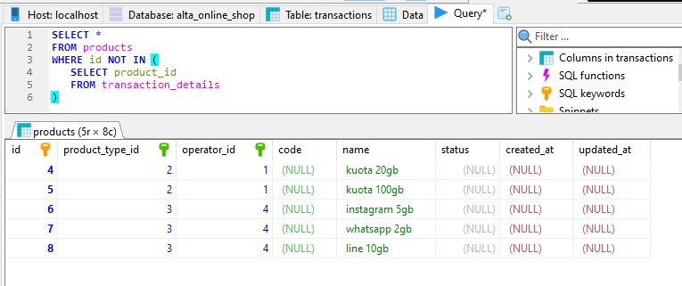

# (14) Join - Union - Agregasi - Subquery - Function (DBMS)

- [Resume](#resume)
- [Praktikum](#praktikum)

# Resume

# Praktikum
## 1. Insert
Pada task ini, saya diharuskan melakukan insert pada tabel yang sudah dibuat

Berikut merupakan source code insert  
[Source code](./praktikum/outlet_pulsa.sql)

## 2. Select
Pada task ini, saya diharuskan menampilkan query sesuai perintah
### a. Tampilkan nama user dengan gender laki laki

### b. Tampilkan product dengan id = 3

### d. Hitung jumlah user dengan gender perempuan

### e. Tampilkan data pelanggan sesuai urutan abjad

### f. Tampilkan 5 data pada product

## 3. Update
Pada task ini, saya diharuskan melakukan update pada data yang sudah di insert

### a. Ubah data product_id = 1 dengan "product_dummy"

## JOIN, Union, Sub Query, Function

### 1. gabungkan data transaksi user id = 1 dan id = 2

### 2. Tampilkan jumlah harga transaksi user id = 1

### 3. Tampilkan total transaksi dengan product type = 2

### 4. Tampilkan semua field table product dan field name product_type yang saling berhubungan

### 8. Tampilkan data product yang tidak pernah ada di tabel transaction_detail dengan sub-query

