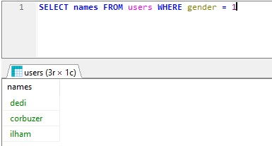
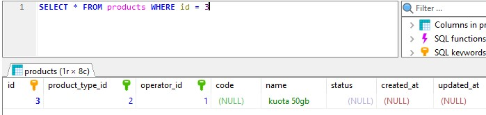
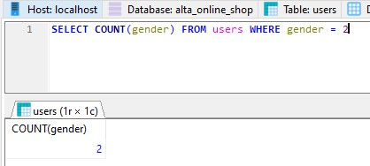
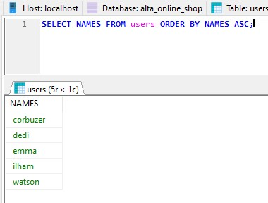
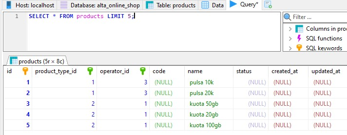

# (14) Join - Union - Agregasi - Subquery - Function (DBMS)

- [Resume](#resume)
- [Praktikum](#praktikum)

# Resume

# Praktikum
## 1. Insert
Pada task ini, saya diharuskan melakukan insert pada tabel yang sudah dibuat

Berikut merupakan source code insert
[Source code](./praktikum/outlet_pulsa.sql)

## 2. Select
Pada task ini, saya diharuskan menampilkan query sesuai perintah
### a. Tampilkan nama user dengan gender laki laki

### b. Tampilkan product dengan id = 3

### d. Hitung jumlah user dengan gender perempuan

### e. Tampilkan data pelanggan sesuai urutan abjad

### f. Tampilkan 5 data pada product

