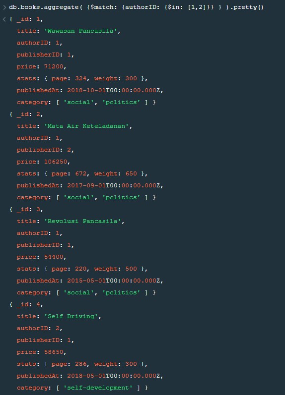
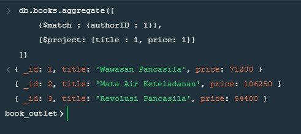

# (16) MongoDB : Advanced Query – Array – Aggregation

- [Summary](#Summary)
- [Praktikum](#Praktikum)

## Summary

## Praktikum
### 1. Gabungkan (menampilkan) data buku dari author id 1 dan author id 2.
```js
db.books.aggregate( {$match: {authorID: {$in: [1,2]}} } )
```
Hasil :  
  

### 2. Tampilkan daftar buku dan harga author id 1.
```js
db.books.aggregate([
    {$match : {authorID : 1}},
    {$project: {title : 1, price: 1}}
])
```

Hasil :  
  

### 3. Tampilan total jumlah halaman buku author id 2.
