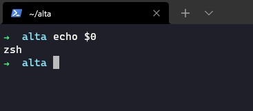
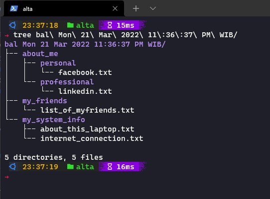

# (17) Configuration Management and CLI

- [Summary](#Summary)
- [Praktikum](#Praktikum)

## Summary

## Praktikum
### 1. Install Oh-my-zsh
  

### 2. Create Automation script
Berikut code untuk melakukan automation script  
[code](./praktikum/automate.sh)

run dengan :  
```./automate.sh arg1 arg2 arg3```

Hasil :  
  

