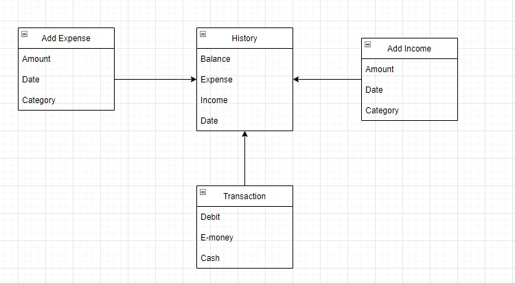
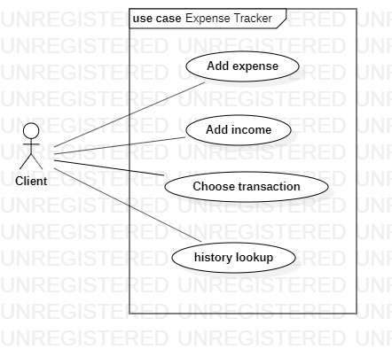

# (18) System Design

- [Summary](#Summary)
- [Praktikum](#Praktikum)

## Summary 
### 1. Diagram Design
Diagram merupakan sebuah representasi symbolic untuk memberikan informasi menggunakan teknik visualisasi.  
Beberapa diagram yang sering digunakan yaitu:
- Flowchart
- Use case
- ERD (entity relational diagram)
- HLA (High level architecture)

### 2. Characteristics Distributed System
- Scalability
- Reliability
- Avaibility
- Efficiency
- Serviceability and Manageability

### 3. Horizontal Scaling and Vertical Scaling
- Vertical scaling digunakan saat ingin meningkatkan ability dan dapat menjamin kalau sistem tersebut dapat bertahan dalam waktu yang lama. Vertical scaling tidak perlu mengubah **source code**
- Horizontal scaling digunakan jika kita tidak bisa memprediksi kemungkinan untuk meningkatkan performa sistem yang terjadi dalam waktu singkat. Horizontal scaling memungkinkan untuk mengubah **source code**

### 4. Job/Work Queue
Job Queue merupakan sebuah data structure yang memungkinkan sistem untuk dimaintain dengan software job schedular untuk mengerjakan suatu pekerjaan.

### 5. Load Balancing
Load balancing memungkinkan untuk membagi traffic yang masuk ke sistem sehingga meningkatkan responsivness dan avaibility nya.  
Kita dapat menambahkan load balancing pada 3 tempat berikut:
- Antara user dengan web server
- Antara web server dengan server aplikasi atau cache server
- Antara internal platform layer dengan database

### 6. Monolithic vs Microservices
- Monolithic adalah sebuah rancangan arsitektur sistem dimana semua proses bisnis berjalan didalam satu build system/server.
- Microservices adalah sebuah rancangan arsitektur sistem dimana proses-proses bisnis berjalan secara terpisah dari beberapa build system, dan beberapa build system tersebut akan bekerja secara colaborasi. 

## Praktikum
### 1. Diagram
Pada task ini, saya diminta untuk membuat diagram ERD dan use case dari studi kasus expense tracker  

- ERD  
  

- Use Case  
  

