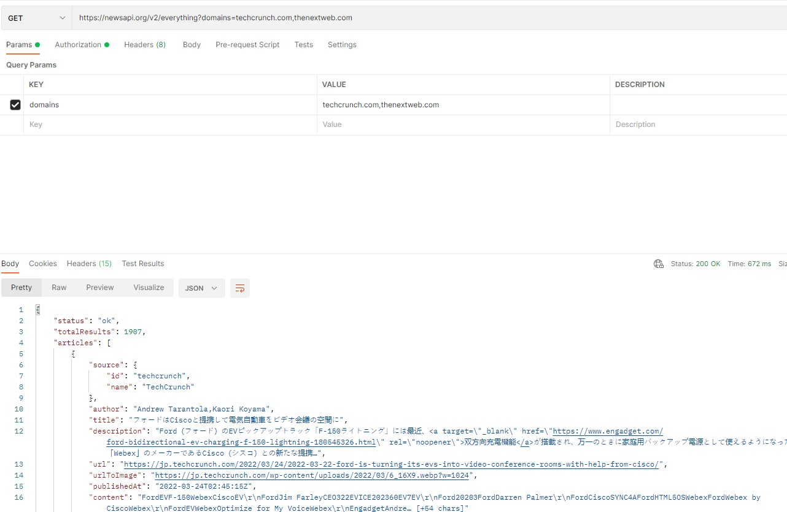
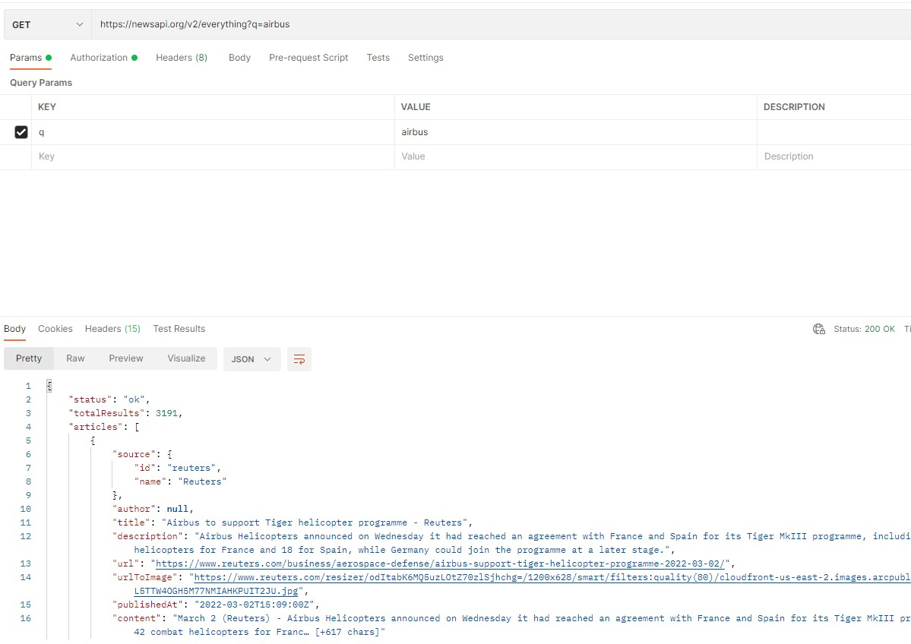
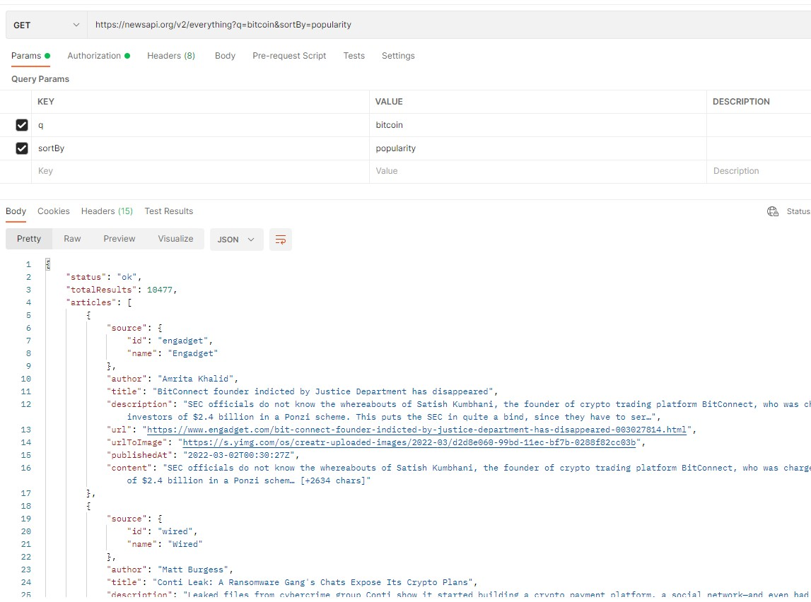
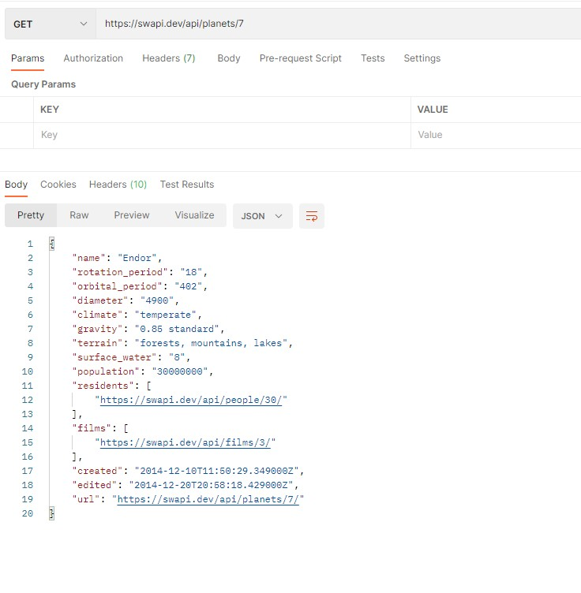
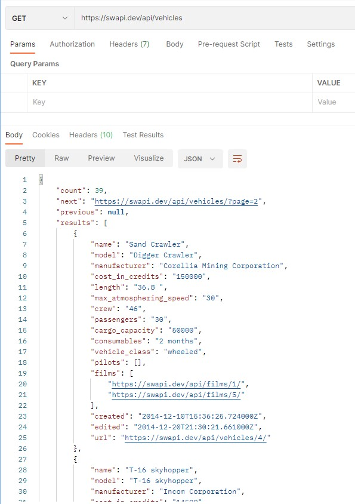

# (19) Intro RESTful API

- [Summary](#Summary)
- [Praktikum](#Praktikum)

## Summary 

## Praktikum
Buat satu collection, dan memanfaatkan fitur environment dan lakukan request terhadap api yang ada di API Documentation menggunakan Postman. Lakukan request terhadap 3 target api berikut!

Berikut json code dari Postman Collection :  
[json](./praktikum/Alta_RESTful.postman_collection.json)  
1. 5 request ke Target API 1 (newsapi.org)  
-   
-   
-   
- 
-   

2. 5 request ke Target API 1 (swapi.dev)  
-  
-  
-  
-  
-  

3. Lakukan request terhadap API dengan mengimplementasikan 4 Method GET, POST, PUT, DELETE (https://virtserver.swaggerhub.com/sepulsa/RentABook-API/1.0.0)
- GET  
 

- POST 

- PUT  

- DELETE  

