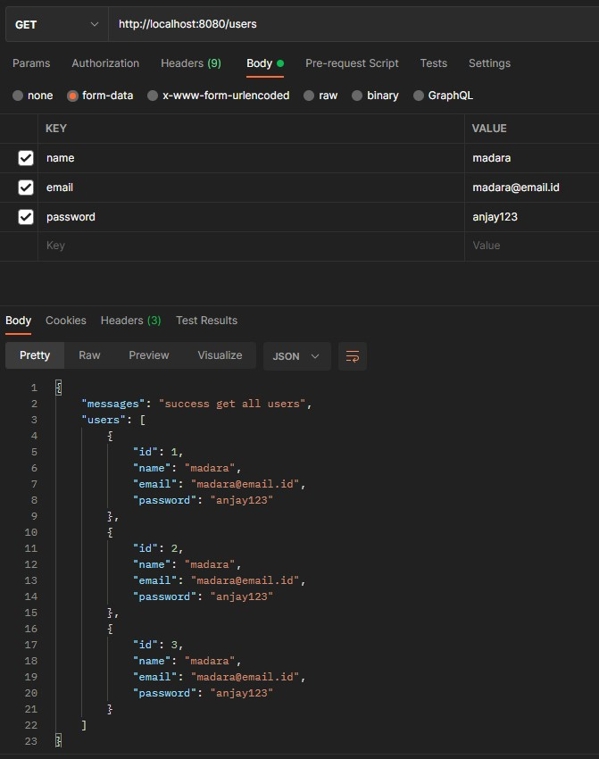
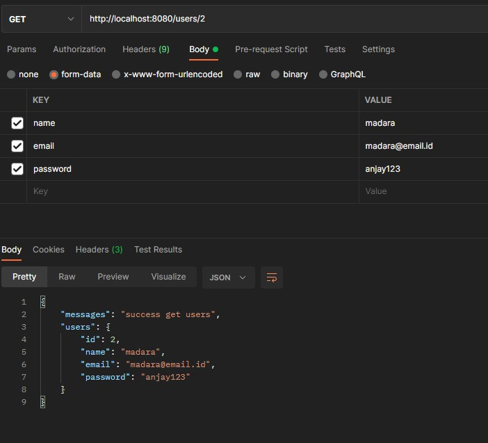
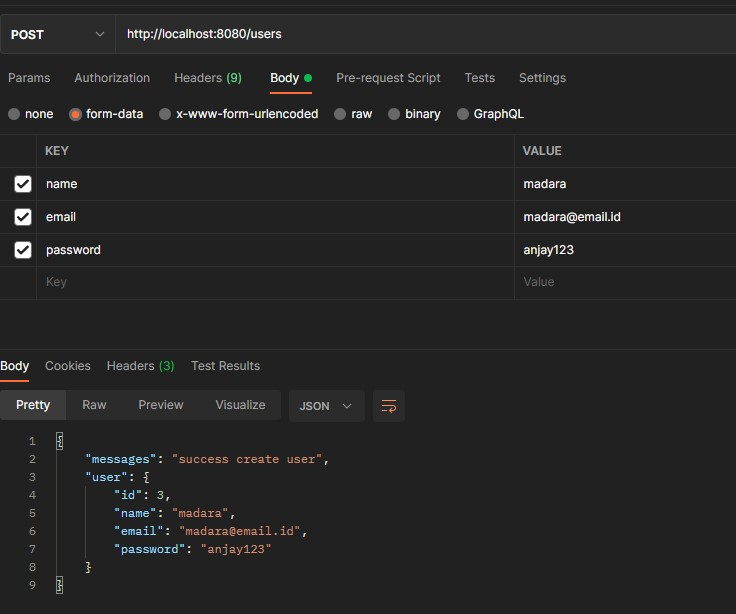
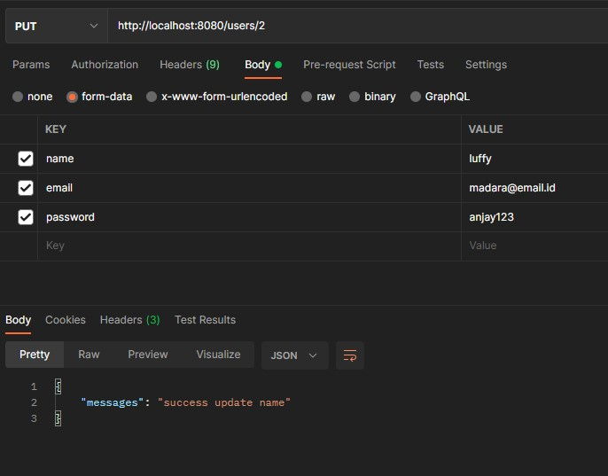
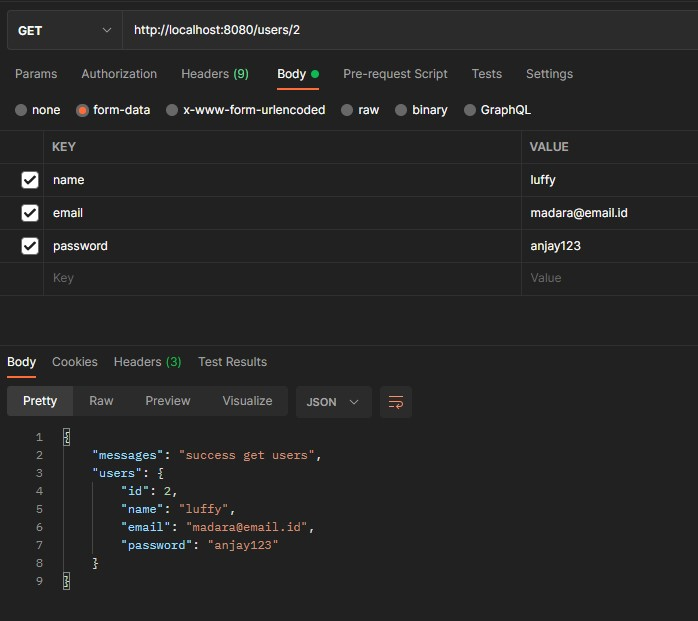
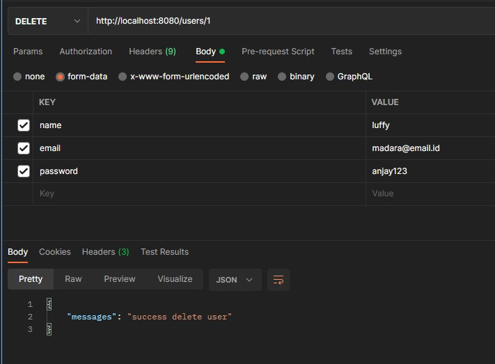
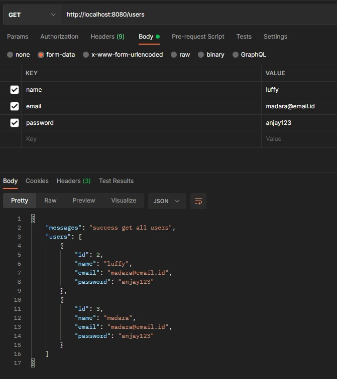

# (20) Intro Echo Golang

- [Summary](#Summary)
- [Praktikum](#Praktikum)

## Summary 

## Praktikum
### Create Static API CRUD User

Berikut adalah source code dari API CRUD :  
[source-code](./praktikum/main.go)

#### 1. GET : Routes (/users)
  

#### 2. GET : Routes (/users/:id)
  

#### 3. POST : Routes (/users)
  

#### 4. PUT : Routes (/users/:id)
- Edit  
  
- Lookup  
 

#### 5. Delete : Routes (/users/:id)
- Delete   
  
- Lookup  
 
