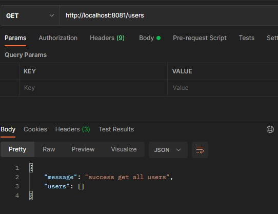

# (21) ORM and Code Structure (MVC)

- [Summary](#Summary)
- [Praktikum](#Praktikum)

## Summary

## Praktikum
### 1. API CRUD User Using Database
#### Sebelum insert ke database

#### Setelah insert ke database
  

#### Update
  

#### Delete

### 2. Structuring Project with Layered Architecture

Berikut merupakan refactor source code dengan MVC   

