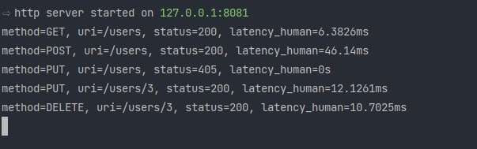
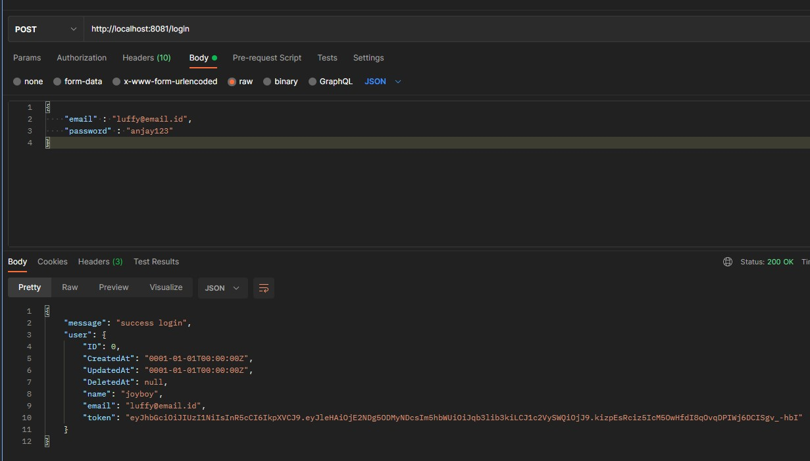
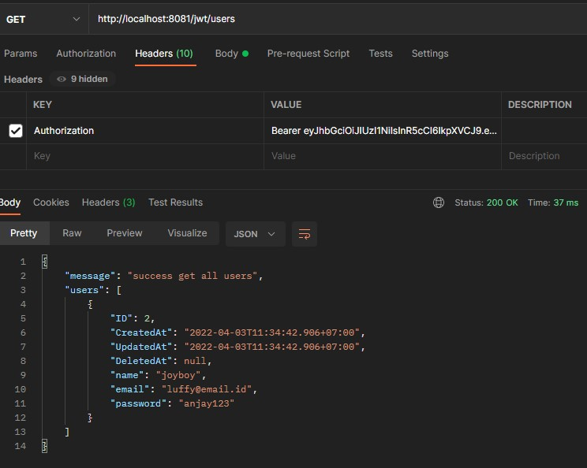

# (22) Middleware

- [Summary](#Summary)
- [Praktikum](#Praktikum)

## Summary

## Praktikum
### 1. Implementasikan Log pada semua fungsi CRUD tersebut

Berikut merupakan hasil dari pengimplementasian logger pada semua

### 2. Buatlah Autentikasi pada API Berikut ini
- Generate Token
  
- Hasil dari GET users dengan JWT
  
