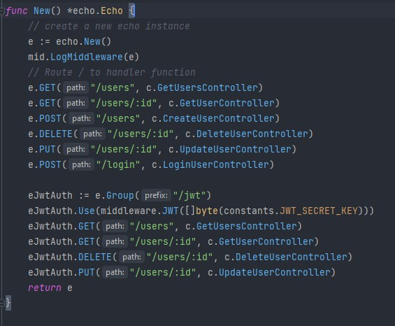

# (22) Middleware

- [Summary](#Summary)
- [Praktikum](#Praktikum)

## Summary
### 1. Pengertian
Middleware adalah sebuah entitas yang terkait dengan proses request/response server . Middleware memungkinkan kita untuk mengimpelemtasikan berbagai macam fungsionalitas saat ada request HTTP yang masuk ke server atau response keluar server

Beberapa contoh implementasi Middleware :
- LoggingMiddleware
- SessionMiddleware
- AuthMiddleware
- CustomMiddleware

Beberapa third-party Middleware yang dapat dipakai dengan Go:
- Negroni
- Echo
- Interpose
- Alice

## Praktikum
### 1. Implementasikan Log pada semua fungsi CRUD tersebut

- Berikut merupakan hasil dari pengimplementasian logger pada semua
  

### 2. Buatlah Autentikasi pada API Berikut ini
- Generate Token
  
- Route dengan JWT Auth
  
- Hasil dari GET users dengan JWT  
  
