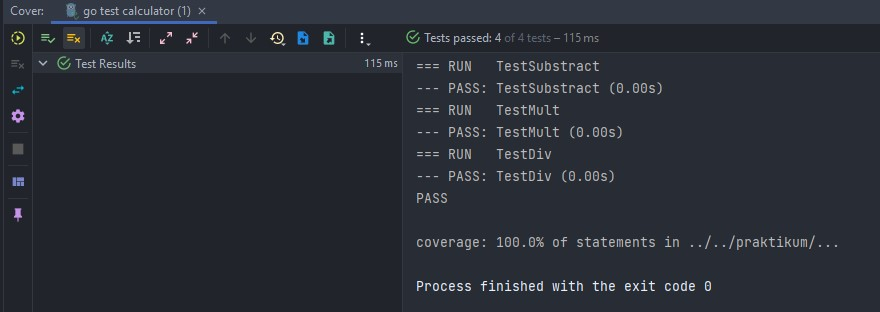
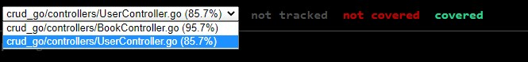
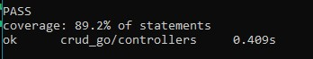

# (23) Unit Testing

- [Summary](#Summary)
- [Praktikum](#Praktikum)

## Summary
Lagi dibuat

## Praktikum
### 1. Simple Unit Testing
Pada task ini diberikan perintah untuk membuat sebuah function calculator dan melakukan testing terhadap function tersebut. Lalu code coverage dari testing itu harus mencapai 100%

Source Code Testing :  
[source-code](./praktikum/calculator/calculate_test.go)

Berikut merupakan coverage dari testing function calculator : 
  

### 2. RESTful API Testing
Pada task ini diberikan perintah untuk mengimplementasikan unit testing dari seluruh endpoint dari project sebelumnya. Dan coverage yang harus dicapai setidaknya >= 80%

Source Code Testing :  
- User Controller   
  [source-code](./praktikum/RESTful-API/controllers/BookController_test.go)
- Book Controller  
  [source-code](./praktikum/RESTful-API/controllers/BookController_test.go)
  
 Berikut merupakan hasil dari coverage report :
 - HTML file  
    
 - CLI  
  
