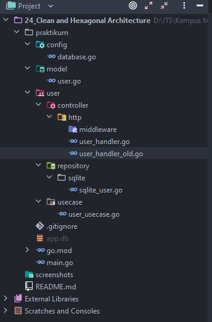
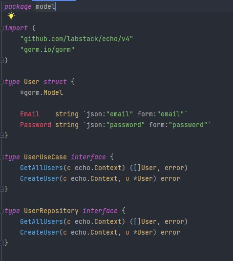
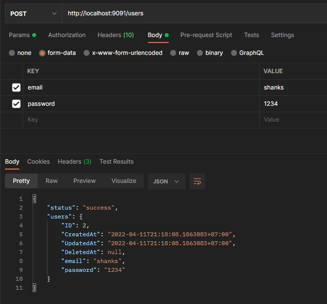
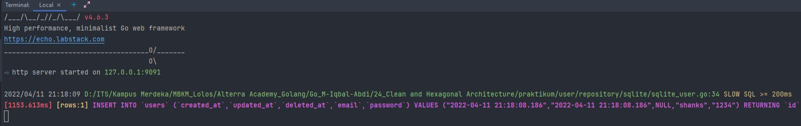
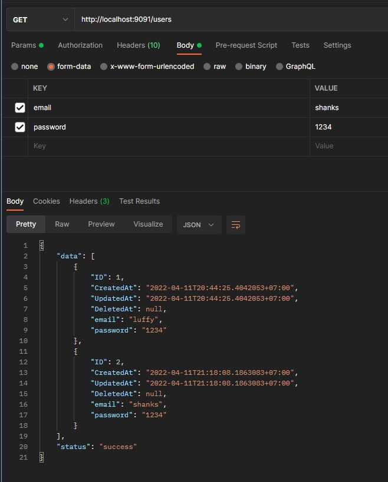

# (24) Clean and Hexagonal Architecture

- [Summary](#Summary)
- [Praktikum](#Praktikum)

## Summary
### Constrains sebelum design clean architecture
- Independent of Framewroks
- Testable
- Independent of UI
- Independent of Database
- Independent of any external
### Keuntungan menerapkan clean architecture
- Struktur yang terstandarisasi
- Faster development
- Melakukan mocking hanya akan bergantung dengan unit test
- Mudah untuk mengganti prototype untuk solusi yang lebih optimal
### Clean Architecture Layer
- Entities Layer
  Merupakan object bussiness
- Use Case - Domain Layer
  mengandung bussiness logic
- Controller - Presentation Layer
  menyajikan data
- Drivers - Data Layer
  Melakukan manajemen terhadap data
### Domain Driver Design (DDD)
Sebuah pendekatan untuk mengembangkan software kompleks yang menghubungkan konsep bisnis dengan implementasi teknis secara mendalam
### Tambahan
Clean Architecture merupakan sebuah software architecture, Domain Driver Design merupakan sebuah teknik desain software

## Praktikum
### 1. Rewrite
Pada task ini diberikan perintah untuk melakukan rewrite dari kodingan pada `https://github.com/hadihammurabi/belajar-go-echo` dengan menerapkan prinsip clean architecture.

Credit : `https://github.com/bxcodec/go-clean-arch`  

Untuk menerapkan prinsip clean architecture, saya menggunakan referensi diagram berikut :  
  

Dengan menggunakan diagram tersebut, saya dapat membuat struktur project saya sebagai berikut :  
 

- model  
     
  directory ini berisi entity user dasn entity ini akan dipakai oleh dua interface yaitu `userRepository` dan `userUseCase`
- user/controller/http  
  directory ini beriisi domain http/delivery/handler dengan RESTful API
- user/repository  
  directory ini berisi domain repository dengan menggunakan Sqlite sebagai database
- user/usecase  
  directory ini berisi bussiness logic pada model User

Hasil :  
- Create User  
    
    
- Get All User  
    
