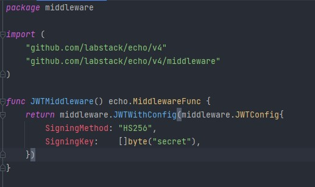

# (25) Clean Architecture JWT 

- [Summary](#Summary)
- [Praktikum](#Praktikum)

## Summary
JWT adalah sebuah token berbentuk string panjang yang sangat random yang gunanya sendiri untuk melakukan sistem Autentikasi dan Pertukaran Informasi.

JWT token terdiri dari :
- header
- payload
- Verify signature 
## Praktikum
### 1. JWT Implementation
Pada task ini, saya disuruh untuk mengimplementasikan JWT pada project di section 24 (yang sudah di rewrite dengan prinsip clean architecture)

Berikut merupakan structure folder project saya :   


Untuk mengimplementasikan JWT, saya menambahkan middleware JWTAuth pada folder http/middleware


Lalu pada handler, saya tambahkan middleware nya
```go
func NewUserHandler(e *echo.Echo, uc model.UserUseCase) {
	handler := &UserHandler{
		UserUC: uc,
	}

	e.GET("/users", handler.GetAllUsers, middleware.JWTMiddleware())
	e.POST("/users", handler.CreateUser, middleware.JWTMiddleware())
	e.POST("/login", handler.Login)
}
```

Berikut merupakan hasil pengimplementasian JWT :  
- No Auth  
  
- Get Token  
  
- With Auth  
  
