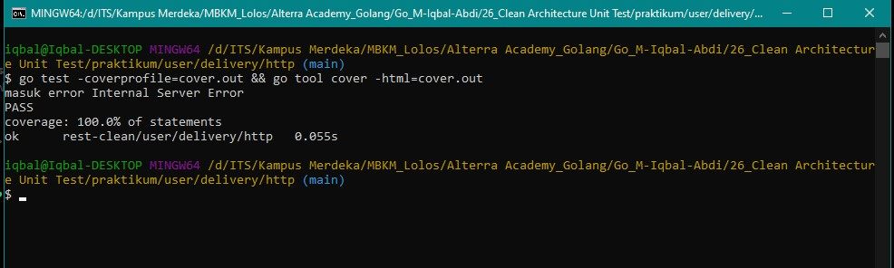
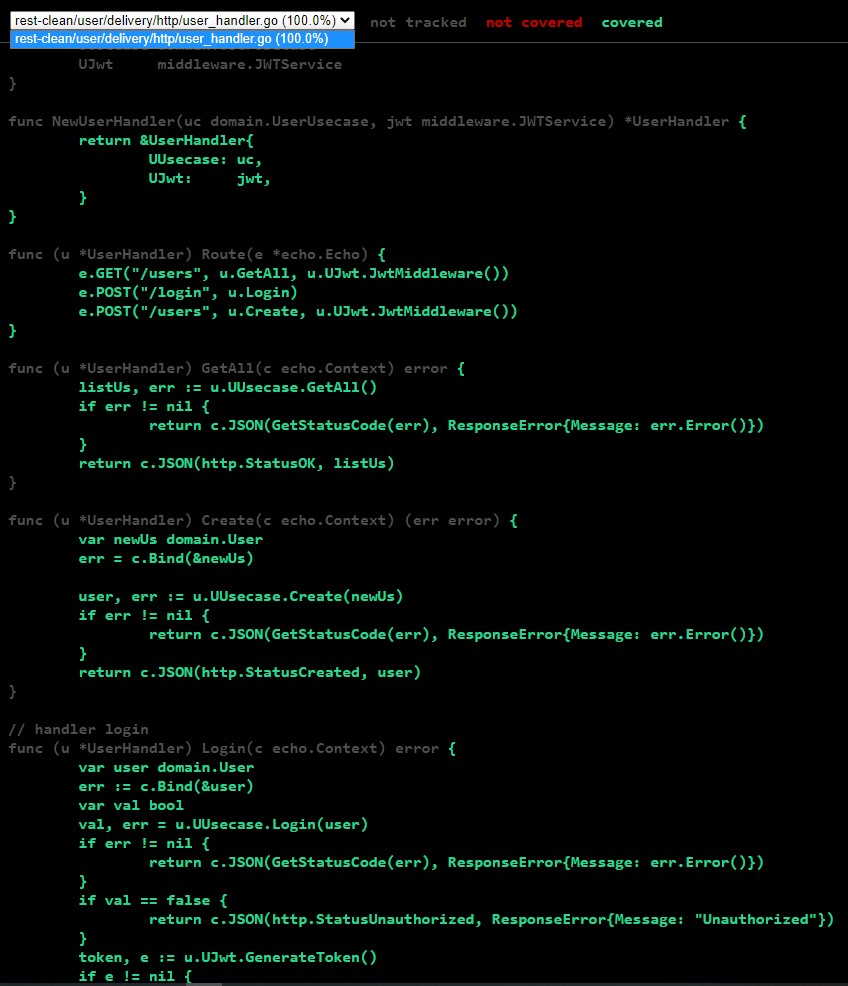
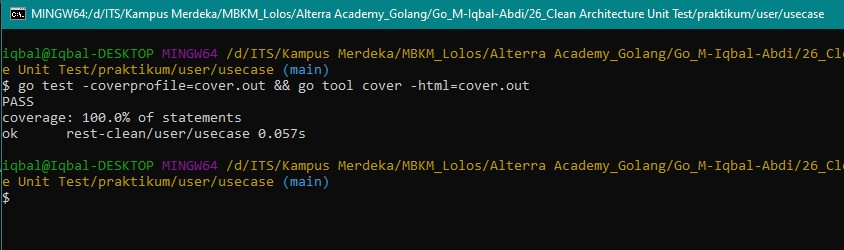
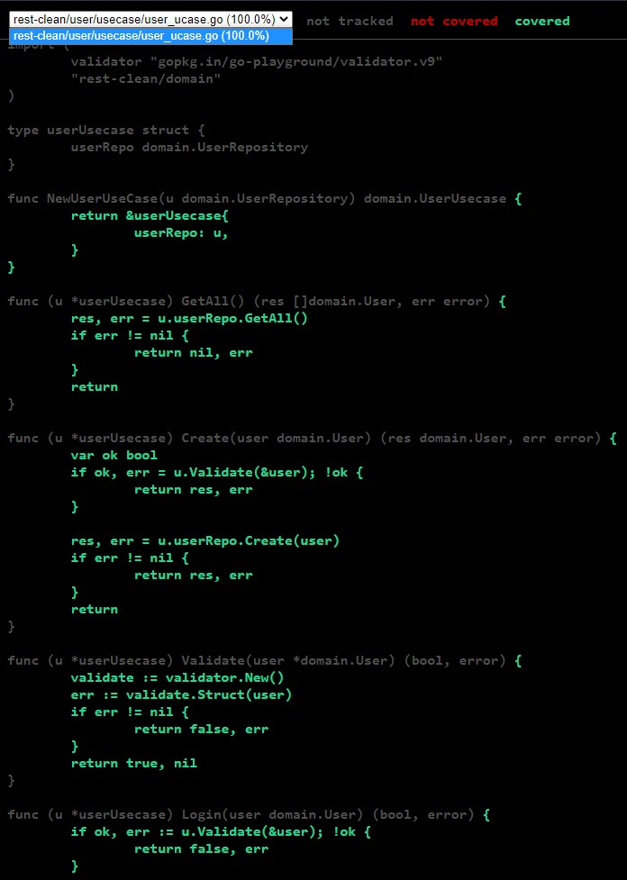
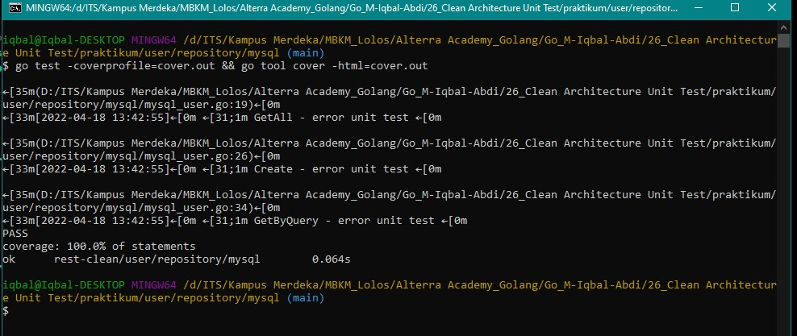
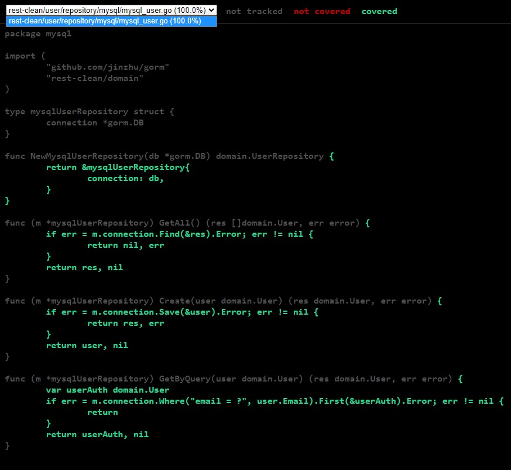

# (26) Clean Architecture Unit Test

- [Summary](#Summary)
- [Praktikum](#Praktikum)

## Summary
Lagi dibuat  
## Praktikum
Pada task kali ini, saya disuruh untuk menambahkan unit testing dari setiap layer pada project yang sudah menerapkan clean architecture sebelumnya.

- Untuk melakukan mocking, saya menggunakan `go-sqlmock` dari `github.com/DATA-DOG/go-sqlmock`
- Untuk melakukan testing, saya menggunakan `testify`

### Layer Delivery
- Berikut merupakan source code testing dari user_handler_test  
  [source-code](./praktikum/user/delivery/http/user_handler_test.go)

- Berikut merupakan hasil dari testing
  1. CLI  
  
  2. coverage.html
  
  
### Layer Usecase
- Berikut merupakan source code testing dari user_ucase_test  
  [source-code](./praktikum/user/usecase/user_ucase_test.go)

- Berikut merupakan hasil dari testing
  1. CLI  
  
  2. coverage.html  
  
  
### Layer Repository
- Berikut merupakan source code testing dari mysql_user_test   
  [source-code](./praktikum/user/repository/mysql/mysql_user_test.go)

- Berikut merupakan hasil dari testing
  1. CLI  
  
  2. coverage.html  
  

