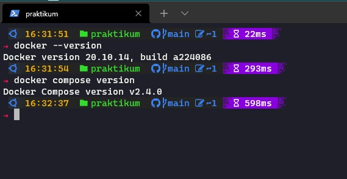
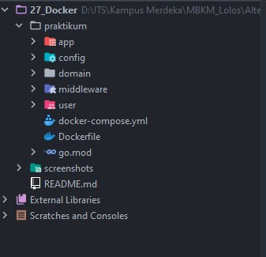
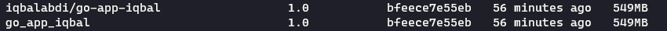
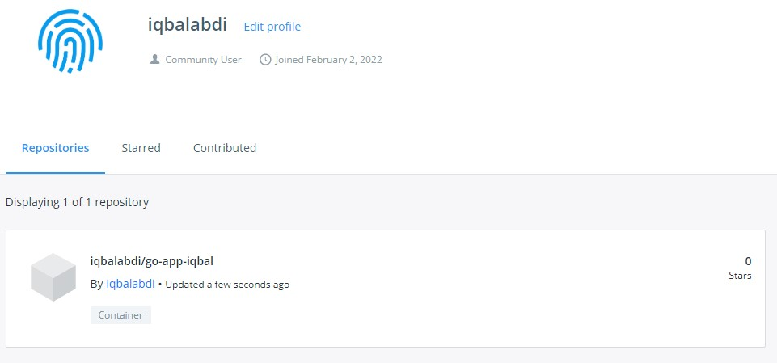

# (27) Docker

- [Summary](#Summary)
- [Praktikum](#Praktikum)

## Summary

### Pengertian
Docker adalah layanan yang menyediakan kemampuan untuk mengemas dan menjalankan sebuah aplikasi dalam sebuah lingkungan terisolasi yang disebut dengan container.

### Istilah
- __Docker image__  
Kumpulan file yang menunjang sebuah aplikasi.
- __Docker container__    
Wadah untuk mengemas dan menjalankan aplikasi. Wadah ini mencakup kode, runtime, system tools, dan pengaturan. Container hanya bisa mengakses - resource yang telah ditentukan dalam Docker image.
- __Docker client__    
Tempat di mana pengguna dapat mengirimkan perintah seperti Docker build, Docker pull, dan Docker run kepada Docker daemon.
- __Docker engine/daemon__    
Sebagai tempat proses pengelolaan Docker images, container, network, dan storage volumes
- __Docker host__  
Komponen yang menyediakan lingkungan untuk menjalankan aplikasi. Docker host bertanggung jawab menerima perintah yang diberikan Docker client.
- __Docker registry__    
Wadah untuk menyimpan Docker image. Docker image akan memberi reaksi sesuai perintah yang diberikan. Misalnya, saat diberi perintah docker push, docker image akan didorong atau dibagikan ke registry Docker Hub.
- __Docker Hub__    
Layanan yang disediakan untuk menemukan dan berbagi Docker image.

### Dockerfile
Dockerfile adalah merupakan skrip yang berisi atau terdiri dari serangkaian perintah, intruksi (argumen) yang akan dieksekusi secara otomatisasi dan berurutan untuk membangun sebuah image.

Syntax pada dockerfile :  


## Praktikum
1. Install Docker & Docker Compose  


2. Create Dockerfile  


3. Clone your code and integrate docker file  
```Dockerfile
FROM golang:1.17-alpine

WORKDIR /app

COPY go.mod ./
COPY go.sum ./

RUN go mod download

COPY . .

RUN go build -a -tags netgo -ldflags '-w -extldflags "-static"' -o /dist ./app/main.go 

EXPOSE 3222

CMD ["/dist"]
```
4. Build your container  


5. Push the image to docker registry  

