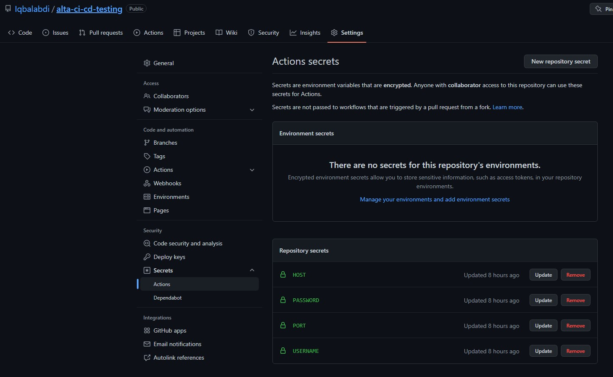

# (29) CI/CD

- [Summary](#Summary)
- [Praktikum](#Praktikum)

## Summary
### Pengertian
- CI/CD disebut juga dengan Continous Integration Continous Deployment. CI/CD menjembatani kesenjangan antara aktivitas pengembangan dan operasi dan tim dengan menerapkan otomatisasi dalam membangun, menguji, dan menyebarkan aplikasi.
### CI (Continous Integration)
- CI (Continous Integration) adalah automated process. Ini diperlukan untuk memberikan perintah untuk mengintegrasikan berbagai codes dari sumber potensial yang berbeda yang akan digunakan untuk build dan test
- Berikut adaalah cycle dari proses CI  
  

### CD (Continous Deployment)
- CD (Continous Deployment) adalah proces untuk melakukan deploy setiap build yang telah terverifikasi
- Berikut adaalah cycle dari proses CD  
  

## Praktikum
Pada praktikum kali ini, diberikan task untuk melakukan clone pada repo `https://github.com/goFrendiAsgard/alta-batch-3-ec2`. Lalu melakukan process CI/CD menggunakan github actions

Steps : 
- Saya membuat repo testing baru di `https://github.com/Iqbalabdi/alta-ci-cd-testing`
- Cloning repo `https://github.com/goFrendiAsgard/alta-batch-3-ec2`
- Push hasil clone ke repo
- Karena untuk koneksi SSH ke server saya menggunakan password, maka pada file `deploy.yml` ada sedikit peenyesuian  
  
- Edit secrets di repo testing agar bisa melakukan deployment ke server  
  
- Run jobs pada Actions  
  
