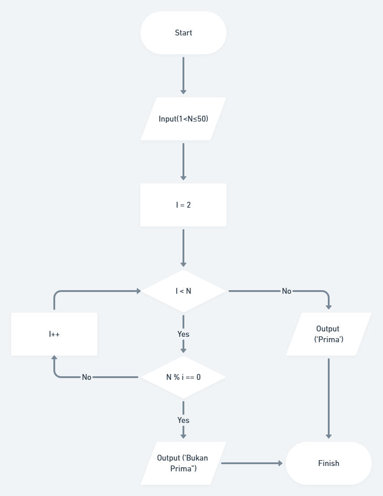
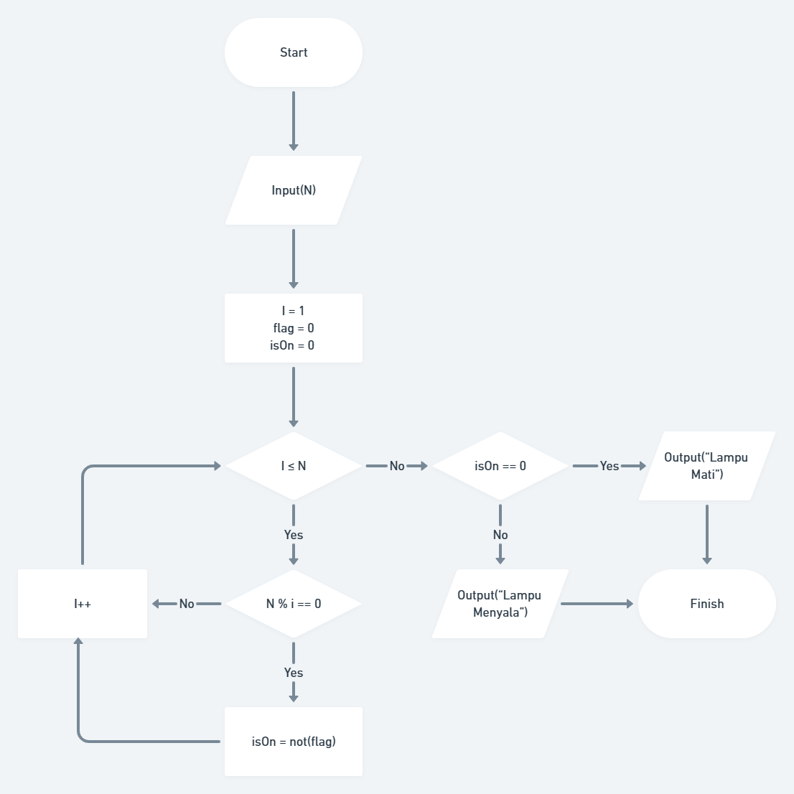
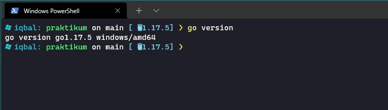
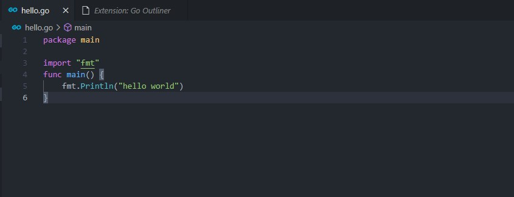
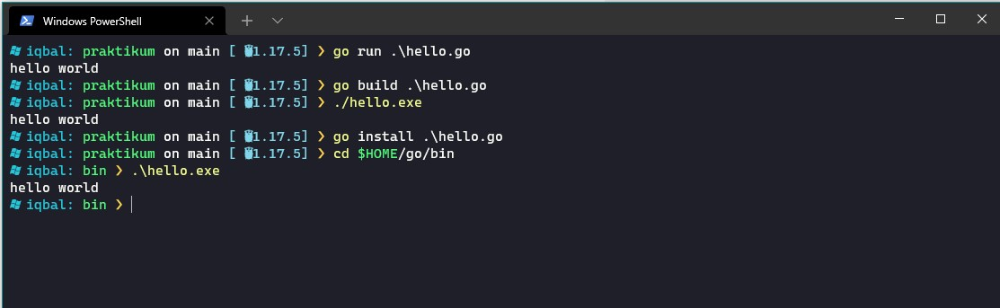

# 3. Introduction to Algorithm and Golang

## Resume
Dalam materi ini, mempelajari:
1. Penngenalan Algoritma
2. Golang (install, run, compile)

### Penngenalan Algoritma
Algoritma didefinisikan sebagai sebuah prosedur komputasi untuk mengambil beberapa nilai sebagai input, memproses nya, lalu menghasilkan sebuah output  
Algoritma mempunyai karakteristik berikut:
1. Memiliki batas (awal dan akhir)
2. Instruksi terdefinisi dengan baik
3. efektif dan efisien

Lalu ada 3 konsep dasar algoritma:
1. Sequential (urutan)
2. Branching (Percabangan)
3. Looping (Perulangan)

Untuk merepresentasikan sebuah algoritma, ada 2 cara yang dapat dilakukan :  
1. Pseudocode, yaitu cara yang lebih sederhana untuk menulis sebuah kode
2. Flowchart, yaitu sebuah diagram diagram yang menampilkan langkah-langkah dan keputusan untuk melakukan sebuah proses dari suatu program

### Golang (install, run, compile)
Sebelum dapat melakukan koding menggunakan golang, kita harus melakukan instalasi golang terlebih dahulu. Pada golang, terdapat 3 perintah yang memiliki kemiripan, yaitu :
1. go run = untuk mengeksekusi file program yang berekstensi (.go)
2. go build = untuk melakukan kompilasi (compile) file berekstensi (.go) sehingga menjadi sebuah binary file
3. go install = sama seperti go build, hanya saja file binary/executable nya terletak pada folder path golang (%HOME/go/bin)

## Task
### 1. Flowchart problem bilangan prima
Pada task ini, dibuat sebuah flowchart yang menggambarkan algoritma untuk menentukan apakah sebuah nilai merupakan bilangan prima atau tidak  
Berikut gambar flowchart bilangan prima:  

Link : https://whimsical.com/prime-number-flowchart-TdC4aSTNrrtcH54Mh7FVi1  
  

### 2. Flowchart problem Lampu-dan-tombol
Pada task ini, dibuat sebuah flowchart yang menggambarkan algoritma untuk menentukan keadaan sebuah lampu (hidup/mati) 
Berikut gambar flowchart problem Lampu-dan-tombol:

Link : https://whimsical.com/lampu-dan-tombol-flowchart-SQ7pCzLNtQN3rtj7nRtEFC
  

### 3. Install Golang  
  

### 4. Hello World!  
Pada task ini, dibuat sebuah program golang yang akan memberikan output string "Hello World!". Instruksi yang akan diterapkan adalah go run, go build, go install
Berikut kode dari program tersebut: 
  

Output :
  
