# 4. Basic Programming

## Resume
Dalam materi ini, mempelajari:
1. Pengenalan Golang
2. Data Type
3. Operator Expression
4. Branching
5. Looping

## Task
### 1. Menghitung Luas Permukaan Tabung
Pada task ini, dibuat sebuah program untuk menghitung luas permukaan tabung dengan input menggunakan `scanf`  

Code :  
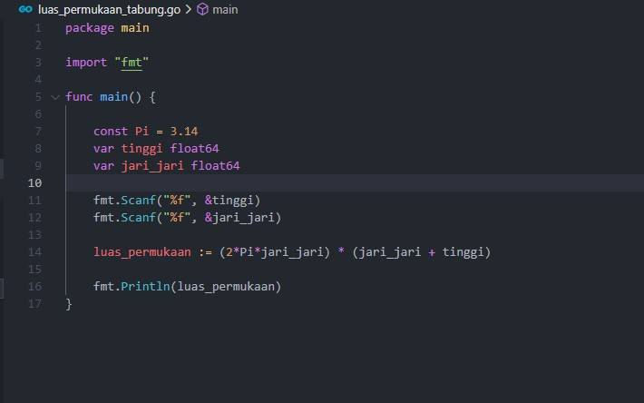  

Output :  
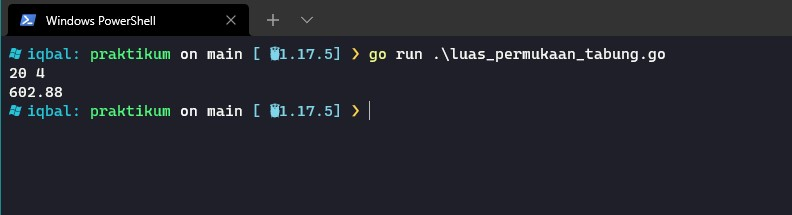  

### 2. Menghitung Grade Nilai
Pada task ini, dibuat sebuah program untuk menghitung grade nilai mahasiswa dengan input nama mahasiswa menggunakan `scanf`  

Code :  
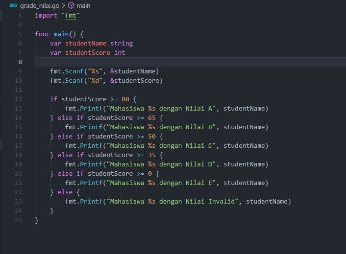 

Output :  
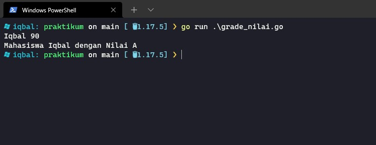  

### 3. Menghitung Faktor Bilangan
Pada task ini, dibuat sebuah program untuk menghitung faktor dari sebuah bilangan dengan input menggunakan `scanf`  

Code :  
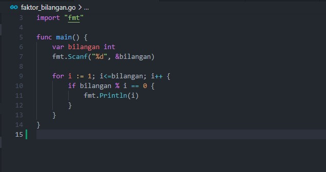 

Output :  
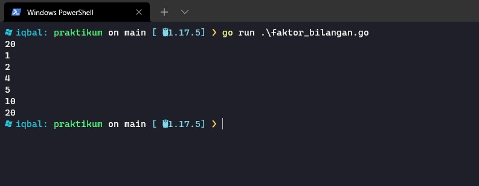 

### 4. Menentukan sebuah bilangan prima
Pada task ini, dibuat sebuah program untuk menentukan apakah sebuah bilangan tersebut meruapakan bilangan prima. Output dari program ini antara `true` atau `false`

Code :  
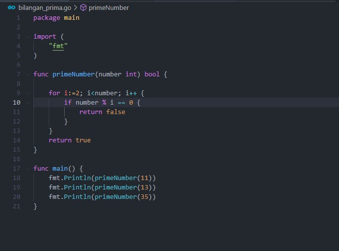 

Output :  
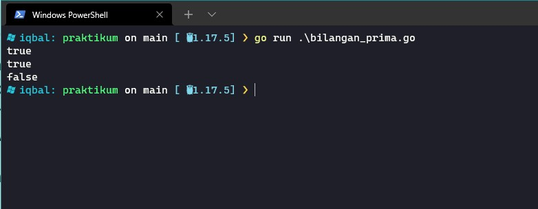   

### 5. Menentukan Palindrome
Pada task ini, dibuat sebuah program untuk menentukan apakah sebuah string tersebut meruapakan sebuah palindrome. Output dari program ini antara `true` atau `false`  

Code :  
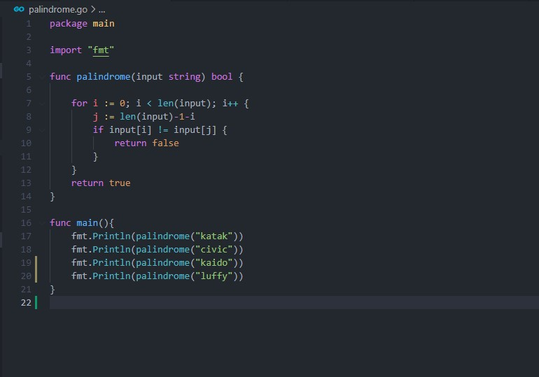 

Output :  
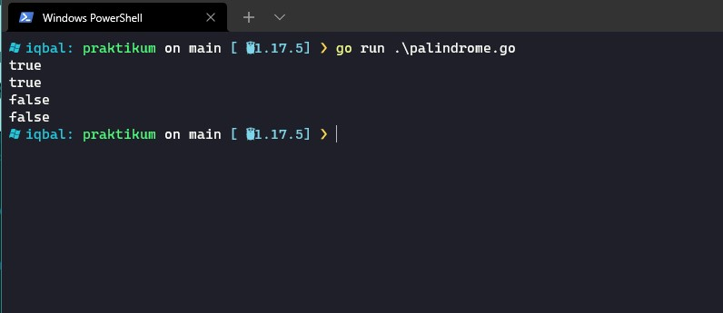 

### 6. Menghitung exponential
Pada task ini, dibuat sebuah program untuk menghitung nilai exponen dari sebuah bilangan

Code :  
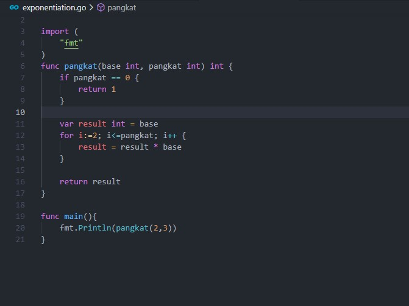 

Output :  
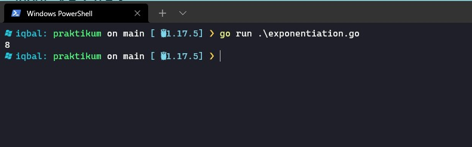 

### 7. Membuat pola
Pada task ini, dibuat sebuah program untuk membuat sebuah pola pyramid menggunakan asterisk

Code :  
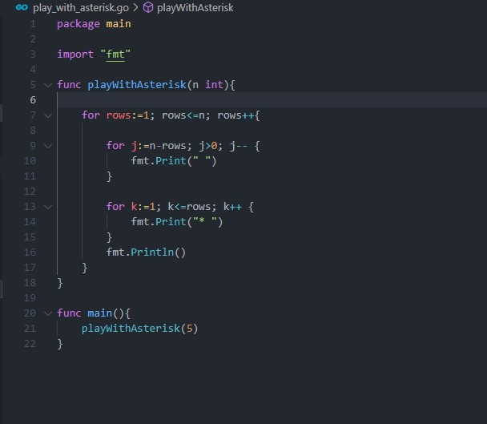 

Output :  
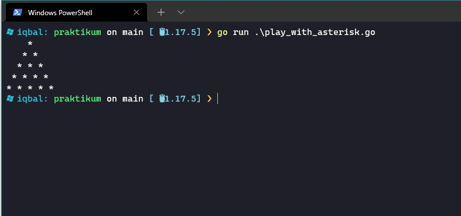 

### 8. Mencetak tabel perkalian
Pada task ini, dibuat sebuah program untuk mencetak sebuah tabel perkalian

Code :  
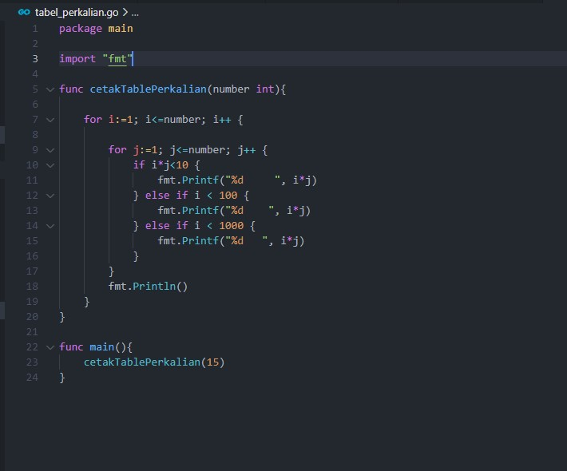 

Output :  
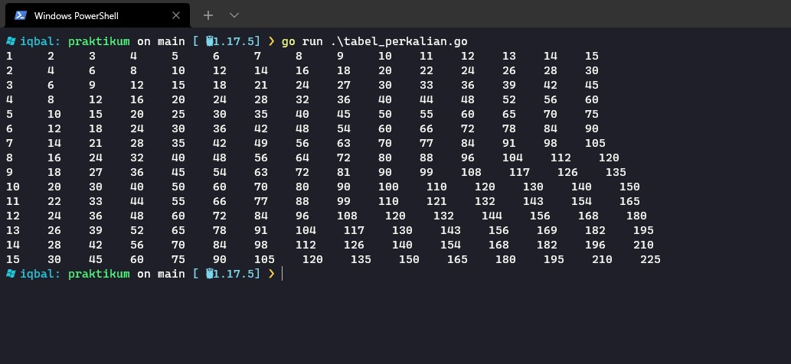 
