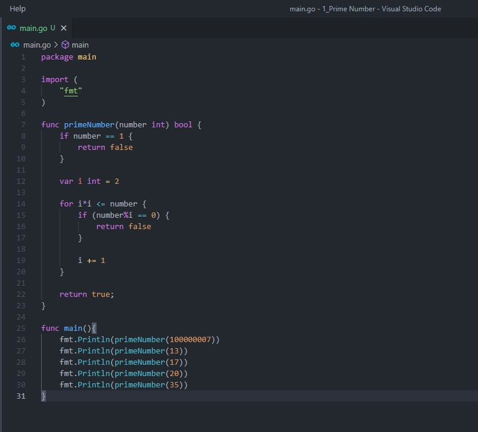
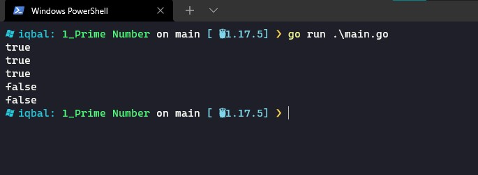
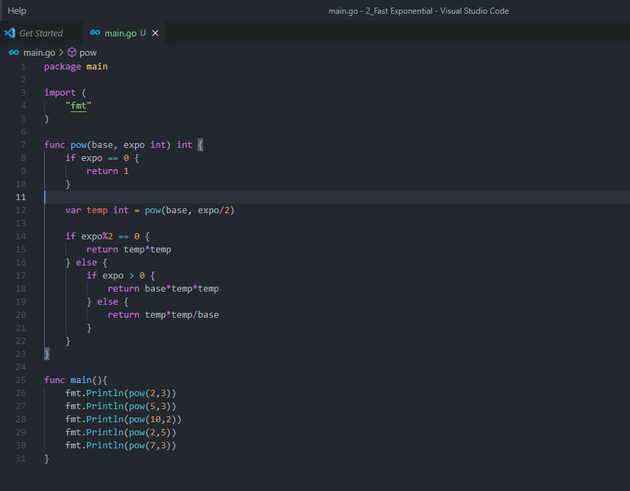
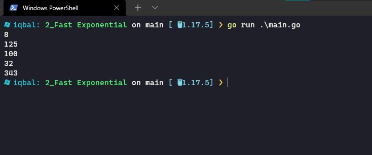

# 5. Time Complexity & Space Complexity

## Resume
Dalam materi ini, mempelajari:
1. Time Complexity
2. Space Complexity

### Time Complexity
Time Complexity menyatakan seberapa lama suatu algoritma berjalan saat runtime dari sebuah program. Bisa terlihat sebagai beapa banyak operasi dominan harus melakukan eksekusi nya. Complexity ini dinyatakan dengan Big-O notation. Beberapa Big-O notation yang biasa ditemui adalah :  
1. O(1) : constat
2. O(n) : linear
3. O(log n) : logaritmic
4. O(n^2) : quadratic

Berikut merupakan grafik dari perbandingan beberapa Big-O notation :  
  

### Space Complexity
Space complexity menyatakan seberapa besar alokasi memory yang diperlukan untuk menjalankan program. Pada space complexity, notasi yang digunakan sama dengan time complexity yaitu menggunakan Big-O notation.

## Task
### 1. Menentukan bilangan prima
Pada task ini, dirancang sebuah program untuk menentukan sebuah bilangan prima dengan komplexitas lebih cepat dari O(n) atau O(n/2)

source code :  
 

output :  
 

### 2. Menentukan nilai exponential
Pada task ini, dirancang sebuah program untuk menghitung nilai exponential dari sebuah bilangan dengan kompleksitas lebih cepat dari O(n)

source code :  

output :  
 

