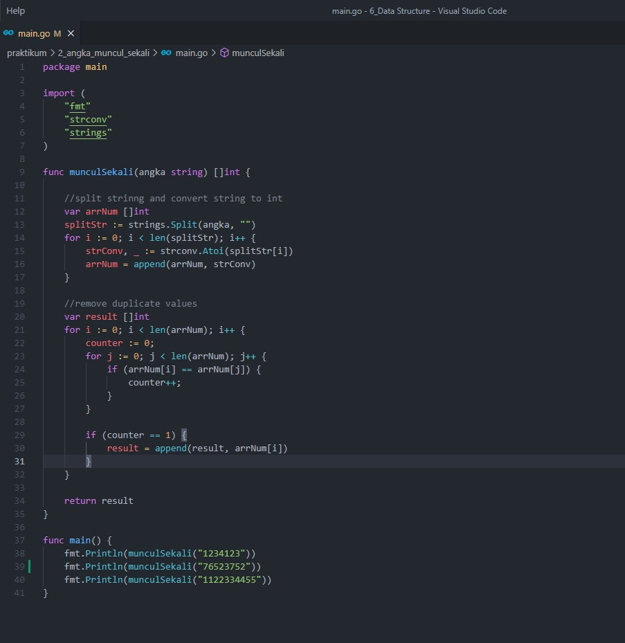

# 6. Data Structure

## Resume
Dalam materi ini, mempelajari:
1. Array
2. Slice
3. Map

### Array

### Slice

### Map

## Task
### 1. Array Merge
Pada task ini, dirancang sebuah program untuk menggabungkan 2 array string. Jika ada elemen yang sama, maka salah satu saja yang ditampilkan

source code :  
 

output :  
 

penjelasan :  
di awal program ini menggabungkan 2 array `arrayA` dan `arrayB`, lalu dibuat sebuah variabel `check` sebagai map dan `result` untuk menyimpan elemen yang akan dicek. Selanjutnya program ini akan melooping pada array yang telah digabung dan menginput elemen `appendArray` sebagai `key` dan `value = 1` ke variabel `check`. Karena disini menggunakan map, sehingga saat looping tersebut elemen yang duplicate tidak akan masuk ke `check`. Lalu map dari `check` akan diappend ke `result`

### 2. Angka Muncul Sekali
Pada task ini, dirancang sebuah program untuk menemukan elemen apa saja yang muncul nya hanya sekali dari sebuah array

source code :  

output :  

penjelasan :   
di awal program ini akan melakukan split pada string `angka` agar menjadi sebuah array. Lalu array tersebut akan dikonversi ke int dengan `strconv.Atoi`. Kemudian dilakukan looping untuk men-check apakah ada nilai yang duplicate dengan variabel `counter`. Jika `counter = 1` maka itu artinya variabel tersebut hanya muncul sekali. Lalu direturn nilai tersebut

### 3. Pair With Target Sum
Pada task ini, dirancang sebuah program untuk menemukan index keberapa yang menghasilkan nilain yang sama dengan target jika elemen pada index tersebut ditambah

source code :  

output :  

penjelasan :   
Program ini menggunakan variabel `low` dan `high` untuk menentukan index dari setiap elemen yang akan ditambahkan. Jika element yang ditambahkan nilainya belum sama dengan target maka value `low` akan ditambah dan value `high` akan dikurang. Hal ini terus berlanjut hingga nilai dari `low` dan `high` dapat menentukan index yang elemen nya jika ditambahkan nilai nya = target. Karena program ini menggunakan satu `for loop` sehingga compleksitas dari program ini adalah O(n)
