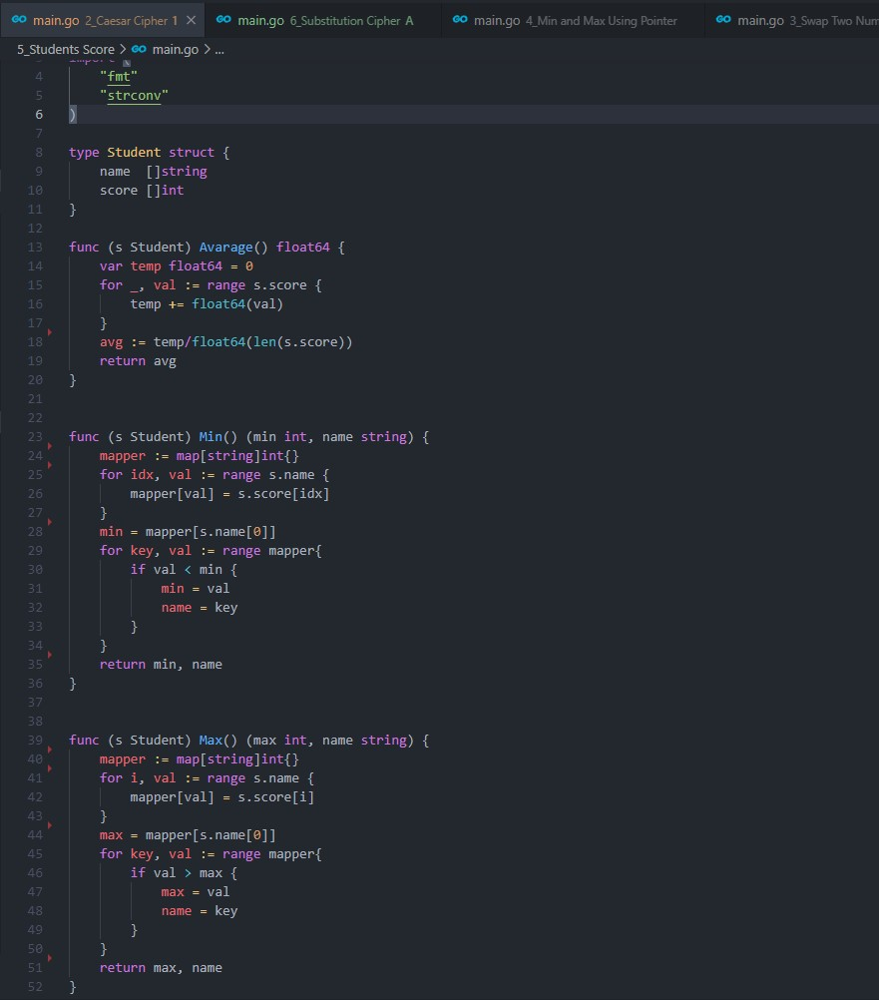
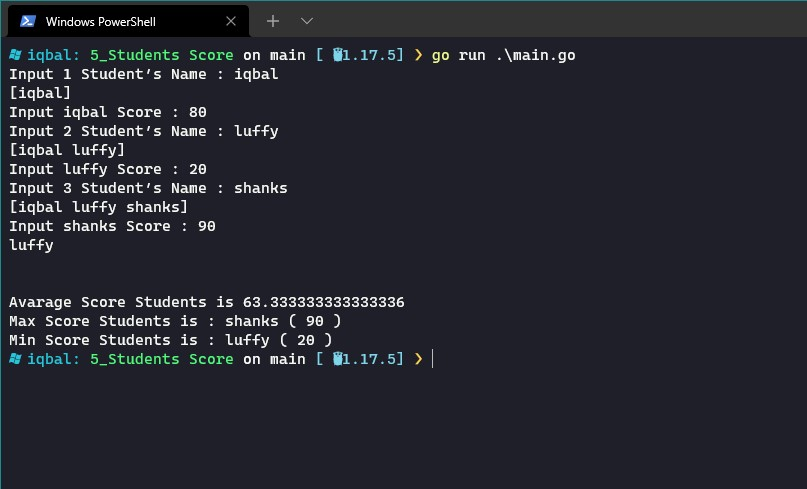
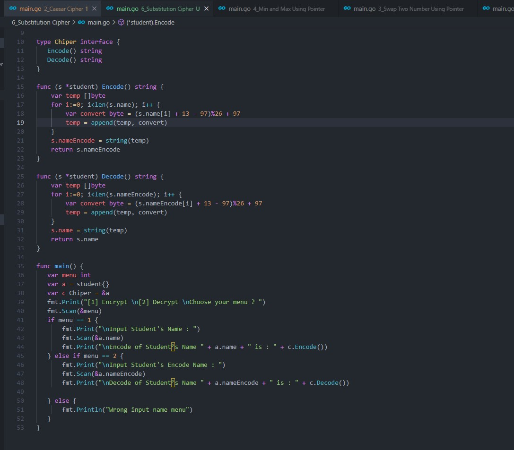
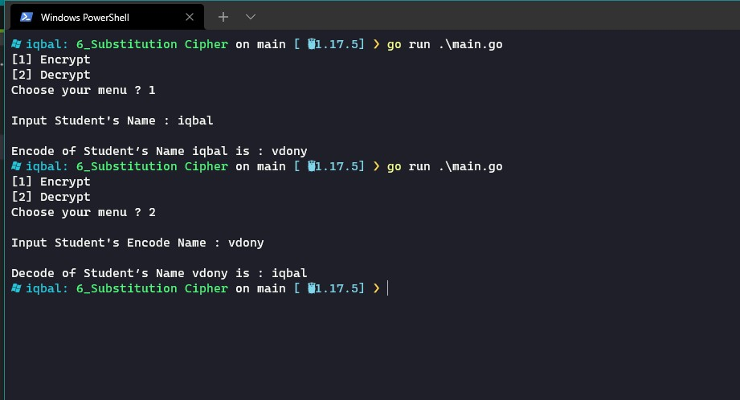

# 7. String - Advance Function - Pointer - Method - Struct and Interface

## Resume
Dalam materi ini, mempelajari:
1. String
2. Advance Function
3. Pointer
4. Struct
5. Method

### String
Ada beberapa fungsi strings pada golang yang biasa dipakai untuk mengolah sebuah strings, yaitu:  
1. len = untuk menentukan panjang sebuah string
2. compare = untuk melakukan comparasi dari 2 buah string
3. contain = untuk menentukan apakah sebuah string merupakan sebuah substring dari string yang lain

### Advance Function
advance function merupakan sebuah konsep function pada golang yang lebih advance dibanding function yang biasa. ada beberapa advance function yang dipelajari, yaitu:  
1. variadic function
2. anonymous function
3. closure function
4. defer function

### Pointer
Konsep pointer sangat penting dari sebuah bahasa pemrograman karena dapat memanipulasi sebuah variabel data pada memori. Ada 2 syntax yang harus dipahami dari pointer, yaitu:  
1. * (asterisk) = menandakan nilai dari sebuah variabel
2. & (ampersand) = menandakan alamat dari sebuah variabel

### Struct
Struct merupakan sebuah tipe data yang didefinisikan oleh user sendiri yang berisi koleksi dari fields/properties

### Method
Method merupakan sebuah fungsi yang menempel pada sebuah tipe data (bisa struct atau tipe data lainnya)

## Task
### 1. Compare String
Pada task ini, dirancang sebuah program untuk mengidentifikasi apakah sebuah string merupakan sebuah substring dari string

source code :  
 

output :  
 

### 2. Caesar Cipher
Pada task ini, dirancang sebuah program untuk melakukan enkripsi pada suatu string dengan metode caesar cipher

source code :  

output :  

### 3. Swap Two Number Using Pointer
Pada task ini, dirancang sebuah program untuk melakukan swap pada sebuah bilangan menggunakan pointer pada golang

source code :  

output :  

### 4. Min and Max Using Pointer
Pada task ini, dirancang sebuah program untuk menentukan nilai minimal dan maksimal dari sebuah slice bilangan dengan pointer

source code :  

output :  

### 5. Students Score
Pada task ini, dirancang sebuah program untuk menghitung rata-rata, nilai terendah dan nilai tertinggi dari sebuah struct

source code :  

output :  

### 6. Subtitution Cipher
Pada task ini, dirancang sebuah program untuk melakukan enkripsi dan dekripsi dari sebuah string

source code :  

output :  

