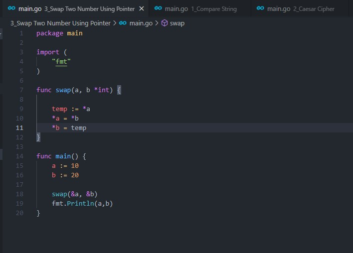

# 7. String - Advance Function - Pointer - Method - Struct and Interface

## Resume
Dalam materi ini, mempelajari:
1. String
2. Advance Function
3. Pointer
4. Method
5. Struct

### Array
Array adalah kumpulan data bertipe sama, yang disimpan dalam sebuah variabel. Array memiliki kapasitas yang nilainya ditentukan pada saat pembuatan, menjadikan elemen/data yang disimpan di array tersebut jumlahnya tidak boleh melebihi yang sudah dialokasikan. Default nilai tiap elemen array pada awalnya tergantung dari tipe datanya. Setiap elemen array memiliki indeks berupa angka yang merepresentasikan posisi urutan elemen tersebut. Indeks array dimulai dari 0.

### Slice
Slice adalah reference elemen array. Slice bisa dibuat, atau bisa juga dihasilkan dari manipulasi sebuah array ataupun slice lainnya. Karena merupakan data reference, menjadikan perubahan data di tiap elemen slice akan berdampak pada slice lain yang memiliki alamat memori yang sama.

### Map
Map adalah tipe data asosiatif yang ada di Go, berbentuk key-value pair. Untuk setiap data (atau value) yang disimpan, disiapkan juga key-nya. Key harus unik, karena digunakan sebagai penanda (atau identifier) untuk pengaksesan value yang bersangkutan.

Map terlihat seperti `slice`, hanya saja indeks yang digunakan untuk pengaksesan bisa ditentukan sendiri tipe-nya (indeks tersebut adalah key).

## Task
### 1. Compare String
Pada task ini, dirancang sebuah program untuk mengidentifikasi apakah sebuah string merupakan sebuah substring dari string

source code :  
 

output :  
 

### 2. Caesar Cipher
Pada task ini, dirancang sebuah program untuk melakukan enkripsi pada suatu string dengan metode caesar cipher

source code :  

output :  

### 3. Swap Two Number Using Pointer
Pada task ini, dirancang sebuah program untuk melakukan swap pada sebuah bilangan menggunakan pointer pada golang

source code :  

output :  

### 4. Min and Max Using Pointer
Pada task ini, dirancang sebuah program untuk menentukan nilai minimal dan maksimal dari sebuah slice bilangan dengan pointer

source code :  

output :  

