# 8. Recursive - Number Theory - Sorting - Searching

- [Resume](#resume)
- [Praktikum](#praktikum)

# Resume

## A. Recursive

- Merupakan metode pemanggilan fungsi sendiri secara berulang
- Metode rekursif dapat memperjelas penyelesaian masalah yang sekiranya mampu dipecahkan dengan demikian
- Berikut hal yang patut dipertimbangkan ketika membangun algoritma rekursif

|Pertimbangan|Deskripsi|
|---|---|
|Base case|apa kasus termudah dari masalah (untuk return)|
|Recurrence relation|Apa hubungan rekursif antara kasus ke `N` dengan kasus ke `N-1`|

## B. Number Theory

- Cabang matematika yang memplajari bilangan `integer`

### Prime Number
```go
func prime(number int) bool {
    if number < 2 {
        return false
    }
    for i := 2; i < int(math.Sqrt(float64(number))); i++ {
        if number % i == 0 {
            return false
        }
    }
    return true
}
```

### GCD
```go
func gcd(a int, b int) int{
    if b == 0 {
        return a
    }
    return gcd(b,a%b)
}
```

### LCM
```go
func lcm(a int, b int) int {
    return a * (b/gcd(a,b))
}
```

## C. Searching

- Linear search, search yang melakukan iterasi terhadap elemen elemen yang ada
- Builtin search, menggunakan fungsi disediakan oleh bahasa pemrograman untuk menggunakan *searching*

## D. Sorting

- Melakukan pengurutan elemen elemen yang ada menjadi desending/ascending.
- Sorting dapat dilakukan baik `integer` maupun `string`, dan bahkan `slice`
- Sorting dapat melalui *builtin sort* yang disediakan oleh `package sort`atau algoritma sort biasa

|Jenis Sort|Kecepatan|Deskripsi|
|---|---|---|
|Selection Sort|`O(n^2)`|Menggunakan inner loop untuk melakukan sorting dan dilakukan sorting terhadap seluruh indeks|
|Counting Sort|`O(n+k)`|Membuat sebuah array flag yang menyimpan indeks dari array yang akan disort, ketika melakukan sorting, diiterasi terhadap array flag kemudian dilakukan penyusunan ulang berdasarkan indeks flag. Namun teknik ini boros memori|

## E. Stack
- `LIFO` *last in first out* seperti mengambil baju dilemari
- Operasi dasar

|Operasi|Deskripsi|
|---|---|
|`.push()`|memasukan elemen|
|`.pop()`|menghapus elemen teratas|
|`.top()`|mengembalikan nilai elemen teratas|

## F. Queue
- `FIFO` *first in first out* seperti mengantre
- Operasi dasar
- 
|Operasi|Deskripsi|
|---|---|
|`.enqueue()`|memasukan elemen|
|`.dequeue()`|menghapus elemen terdepan|
|`.front()`|mengembalikan nilai elemen terdepan|

## F. Priority Queue
- Menggunakan prisip binary tree heap (BFS)
- Sorting `queue` berdasarkan fungsi evaluasi (default:max())
- Operasi dasar

|Operasi|Deskripsi|
|---|---|
|`.enqueue()`|memasukan elemen|
|`.dequeue()`|menghapus elemen terdepan|
|`.top()`|mengembalikan nilai elemen teratas|

## G. Dequeue
- Mirip seperti `queue` memiliki kemampuan melakukan operasi terhadap elemen terdepan dan terbelakang
- Operasi dasar

|Operasi|Deskripsi|
|---|---|
|`.push_front()`|memasukan elemen ke depan|
|`.push_back()`|memasukan elemen ke belakang|
|`.pop_front()`|menghapus elemen terdepan|
|`.pop_back()`|menghapus elemen terbelakang|
|`.front()`|mengembalikan nilai elemen terdepan|

## H. Set dan Map
- `Set` sebagai kolesi dari elemen berbeda yang terdefinisi
- `Map` merupakan `dictionary` yang artinya mendefinisikan suatu nilai (yang unik) ke sebuah nilai lain sehingga disebut juga *associative container*
- Keduanya dapat diimplementasikan secara *ordered* maupun *unordered*

# Praktikum
## 1. Prima ke-x

source code:  
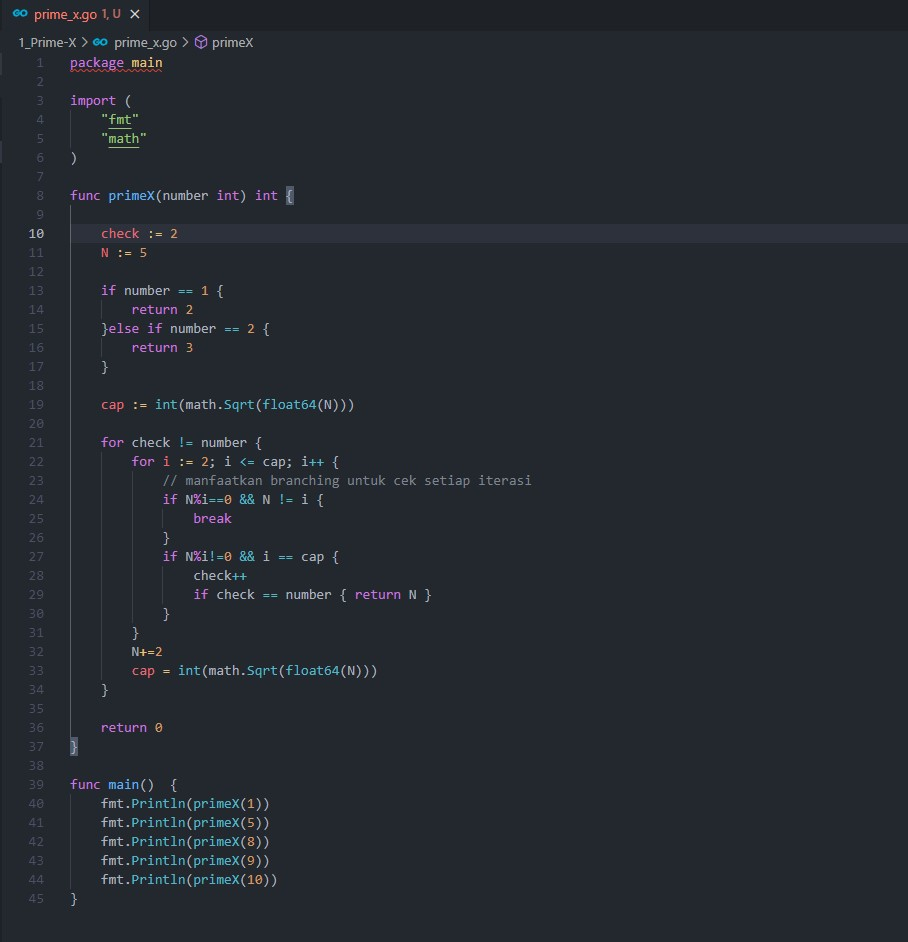

output:  
source code:  
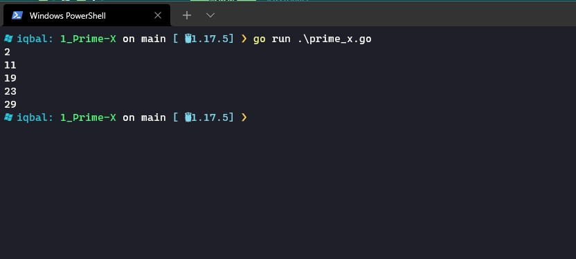

## 2. Fibonacci

source code:  
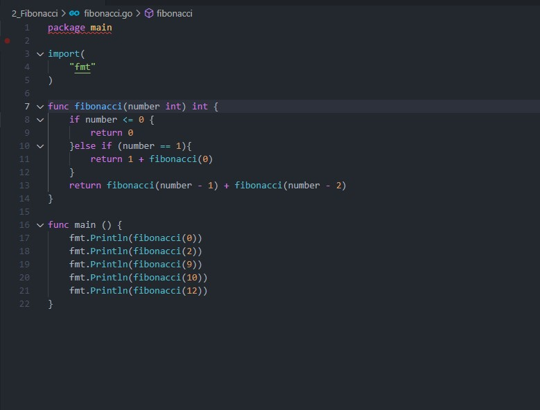

output:  
source code:  
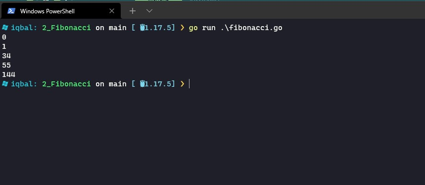

## 3. Prima Segi Empat

source code:  
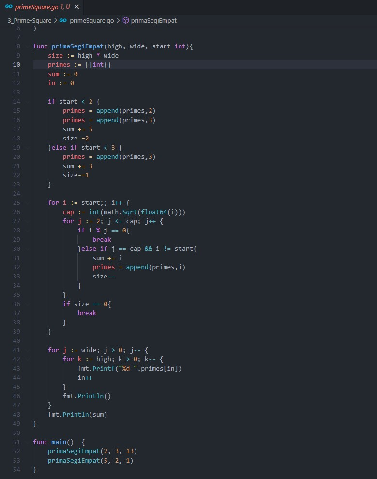

output:  
source code:  
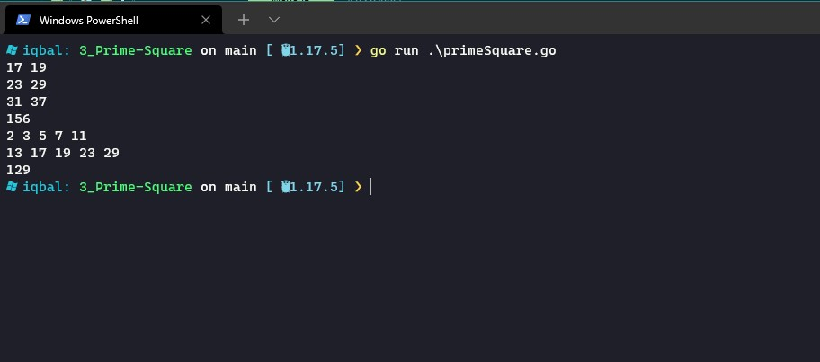

## 4. Total Maksimum dari deret bilangan

source code:  
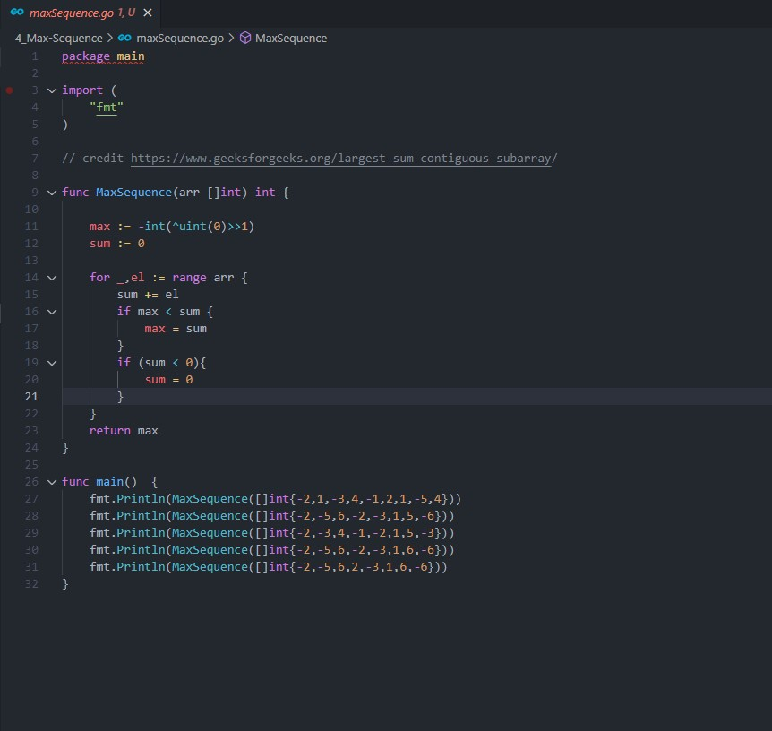

output:  
source code:  


## 5. Find Min and Max Number

source code:  
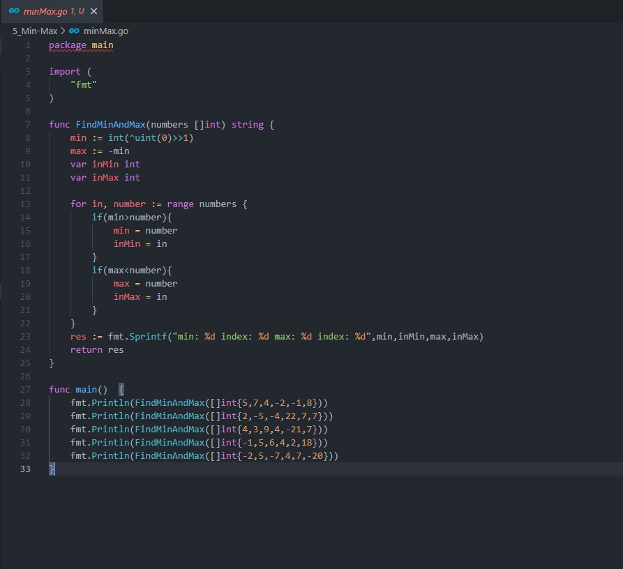

output:  
source code:  
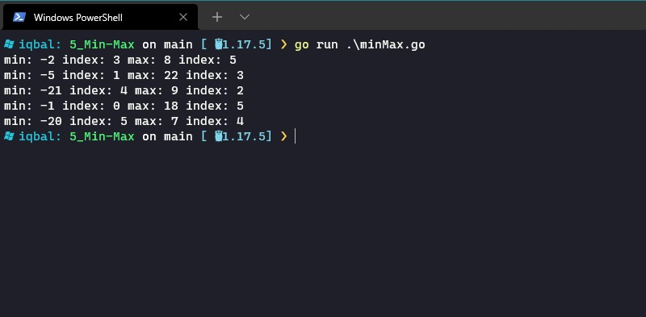

## 6. Maximum Buy Product

source code:  
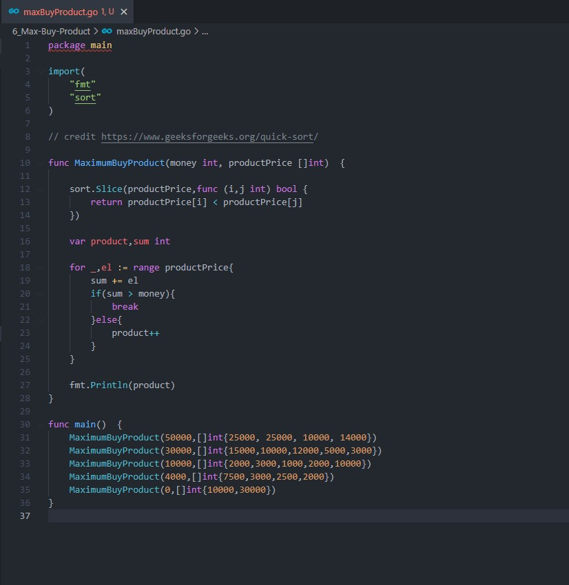

output:  
source code:  
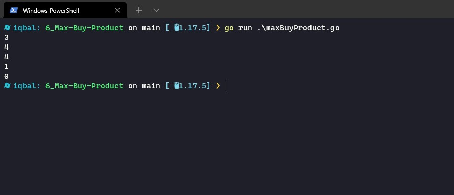

## 7. Playing Domino

source code:  
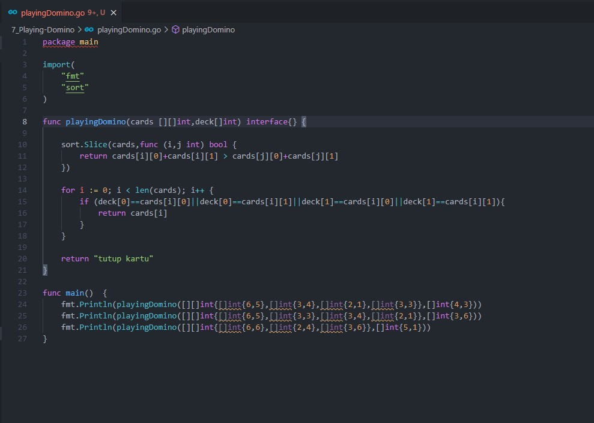

output:  
source code:  
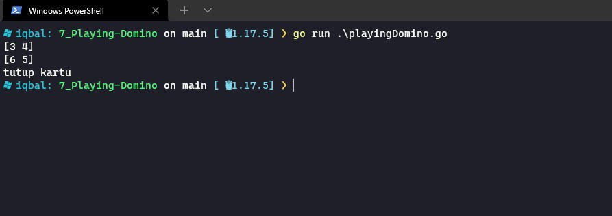

## 8. Most Appear Item

source code:  
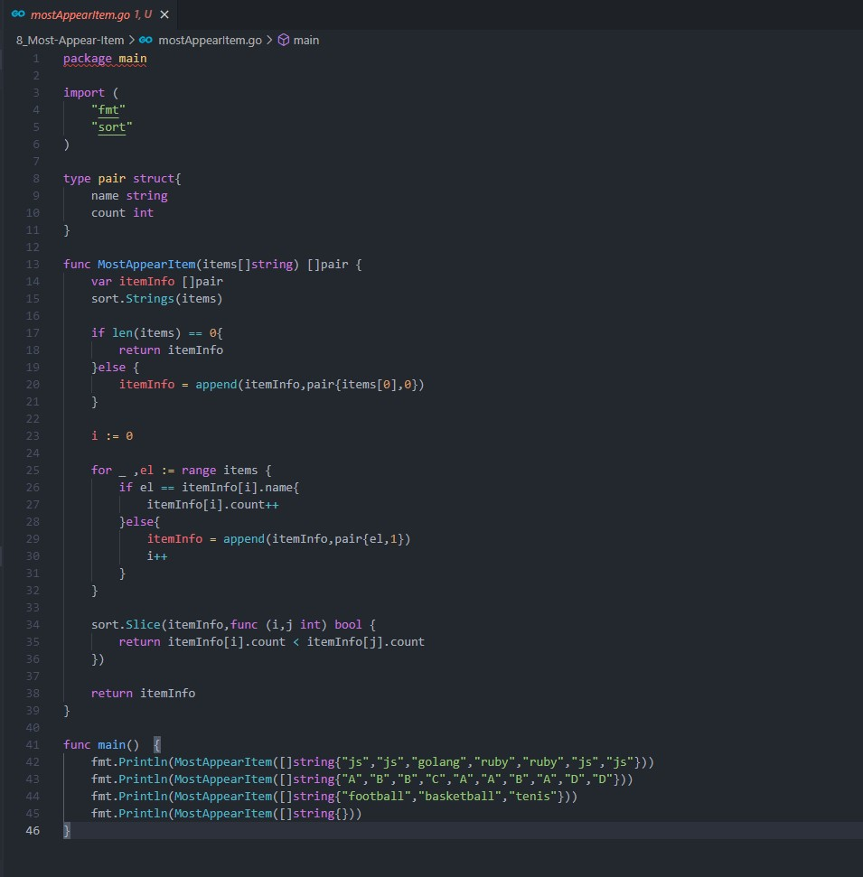

output:  
source code:  
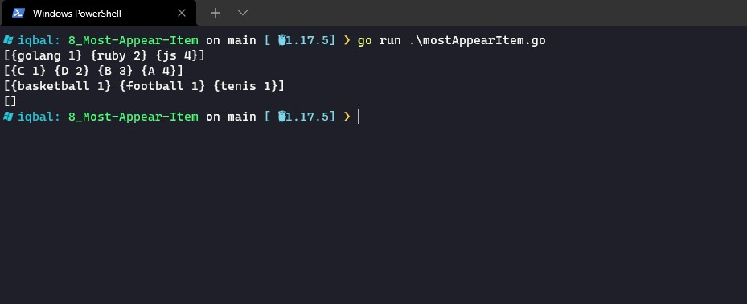


