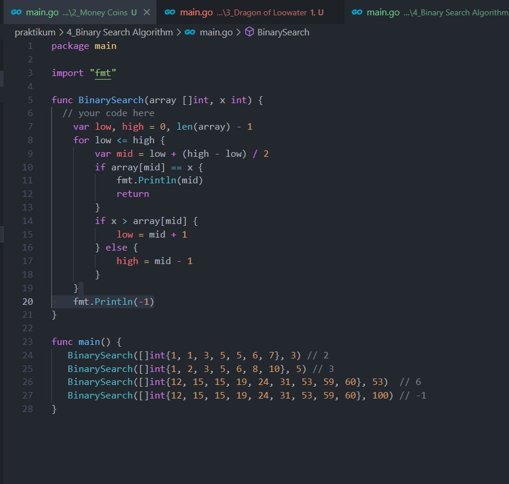
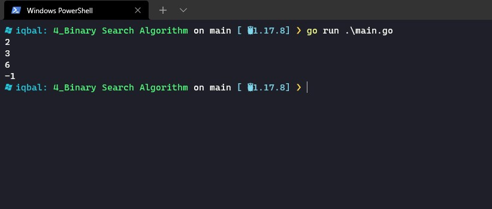

# (9) Brute Force - Greedy and Divide and Conquer

- [Resume](#resume)
- [Praktikum](#praktikum)

# Resume

## A. Brute Force
- Algoritma BruteForce juga dikenal dengan Complete Search adalah sebuah metode untuk menyelesaikan sebuah problem dengan melakukan traverse pencarian untuk menemukan solusi yang diharapkan 
- Bruteforce terjadi ketika tidak ada algoritma lain yang tersedia
- Lebih mudah menulis kode nya karena straightforward 
- Secara teori semua problem dapat diselesaikan dengan brute force jika time limit yang dibutuhkan unlimited  
## B. Greedy
Algoritma greedy merupakan algoritma yang bersifat heuristik dan urutan logisnya disusun berdasarkan langkah-langkah penyelesaian masalah yang disusun secara sistematis. 
Contoh algoritma greedy :
- Huffman Coding
- Activity Selection
- Djikstra Algorithm

## C. Divide and Conquer
D&C adalah sebuah algoritma yang menyelesaikan sebuah problem dengan membagi-bagi problem tersebut menjadi parts yang lebih kecil dam masalah kecil tersebut akan diselesaikan secara bertahap

# Praktikum
## 1. Simple Equations

source code:  

output:  
source code:  

## 2. Money Coins

source code:  

output:  
source code:  

## 3. Dragon of Loowater

source code:  

output:  
source code:  

## 4. Binary Search Algorithm

source code:  

output:  
source code:  

